# CU-CP


The CU-CP, or Central Unit - Control Plane, is responsible for the handling of control plane messaging, specifically, the control plane part of the PDCP protocol. The CU-CP communicates directly with the 5G Core (via the N2 interface), the CU-UP (via the E1 interface), the DU-high (via the F1-c interface), neighbouring gNBs (via the Xn-c interface), the LMF (via NRPPa), and can also be connected to the near-RT RIC (via the E2 interface). This implementation takes a UE-centric approach.

[Return to top level architecture diagram](../README.md).

## Components

- **[CU-CP Controller](cu_cp_controller/README.md)**: Controls and monitors all remote node connections (AMF, DU, CU-UP, XN-C peer). Enforces UE admission control and gates DU setup requests on AMF availability. Drives NG Setup on startup and reconnects automatically after N2 link loss.
- **[CU-UP Processor](cu_up_processor/README.md)**: Handles each connected CU-UP via the E1 interface. Multiple CU-UPs can be connected to a single CU-CP; a dedicated E1AP instance is created inside the CU-UP Processor for each.
- **[DU Processor](du_processor/README.md)**: Handles each connected DU. Bundles the F1AP entity and RRC handler per DU instance. Responsible for creating and managing UE RRC contexts when UEs attach to the DU.
- **[UE Manager](ue_manager/README.md)**: Central UE lifecycle manager. Allocates and removes UE contexts, provides UE lookups by PCI/C-RNTI and I-RNTI, and owns per-UE task schedulers.
- **[UE Security Manager](ue_security_manager/README.md)**: Holds the per-UE NR security context. Selects AS algorithms, derives RRC and UP keys, and supports horizontal key derivation for handover and reestablishment.
- **[UP Resource Manager](up_resource_manager/README.md)**: Maintains the per-UE user-plane resource state. Validates NGAP PDU session requests, allocates DRB IDs, and computes E1AP and F1AP configuration updates.
- **[Cell Measurement Manager](cell_meas_manager/README.md)**: Tracks cell measurement configurations and neighbour relationships. Notifies the Mobility Manager when a neighbour cell becomes better than the serving cell.
- **[Mobility Manager](mobility_manager/README.md)**: Orchestrates handover decisions and mobility procedures (intra/inter-gNB, conditional handover). Interfaces with the Cell Measurement Manager, NGAP, F1AP, and XnAP.
- **[UE Location Manager](ue_location_manager/README.md)**: Manages per-UE location reporting configuration from the AMF and generates location reports from UE measurement data.
- **[Metrics Handler](metrics_handler/README.md)**: Aggregates performance counters from all sub-components and delivers periodic reports to registered consumers.

## Interfaces

- **F1-c**: Control plane interface with the DU (TS 38.473).
- **N2**: Control plane interface with the 5G Core AMF (TS 38.413).
- **E1**: Interface with the CU-UP (TS 37.483).
- **Xn-c**: Inter-gNB control plane interface for handover coordination (TS 38.423).
- **NRPPa**: Interface with the Location Management Function (LMF) for UE positioning (TS 38.455).
- **E2**: Interface with the near-RT RIC (O-RAN).

---

## Procedures

### Infrastructure Setup

#### F1 Setup

Establishes the F1-c connection between a DU and the CU-CP (TS 38.473 §8.2.3).

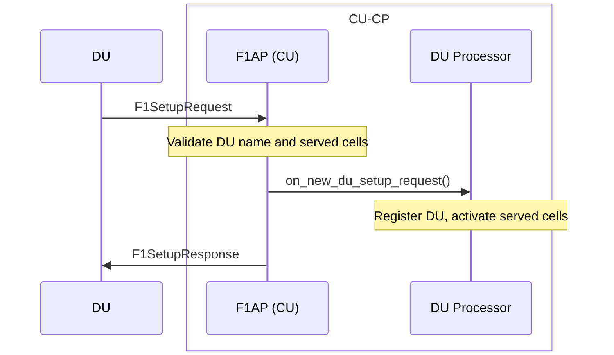

#### NG Setup

Establishes the N2 connection between the CU-CP and the AMF (TS 38.413 §8.7.1). Retries with the AMF-provided back-off timer on failure.

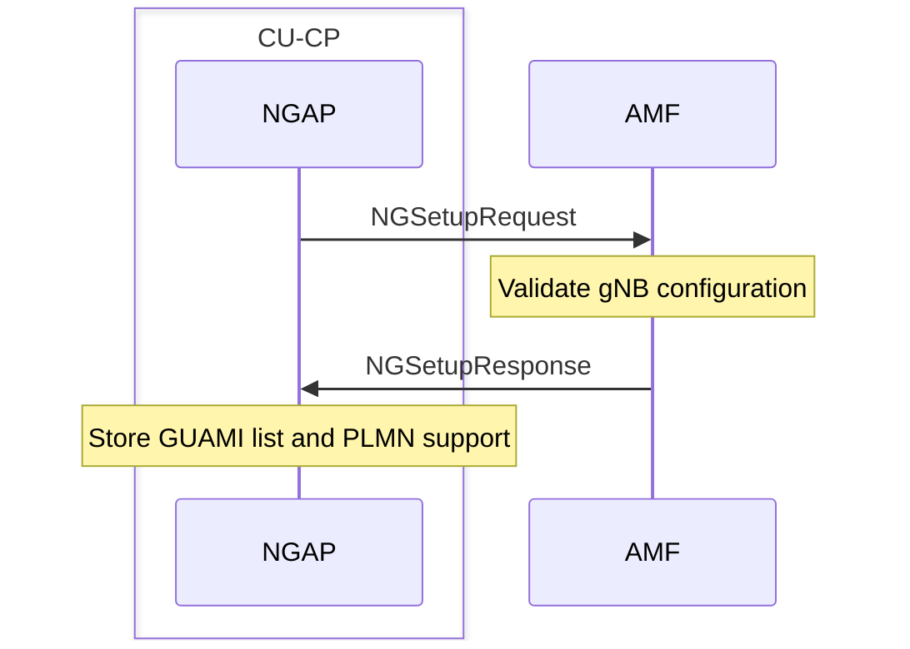

#### E1 Setup

Establishes the E1 connection between the CU-CP and a CU-UP (TS 37.483 §8.2.1). The CU-UP initiates the procedure by sending a GNB-CU-UP E1 Setup Request.

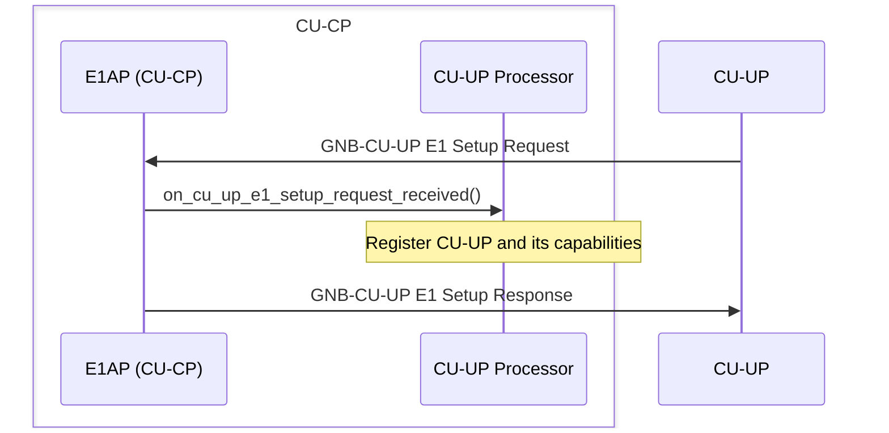

#### Xn Setup

Establishes a direct Xn-c connection between two gNBs for handover without AMF involvement (TS 38.423 §8.10.1). Retries with the peer-provided back-off timer on failure.

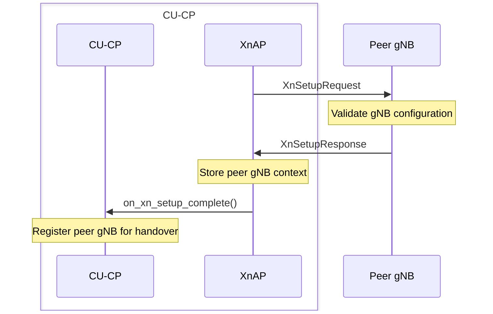

---

### Connection Establishment

#### RRC Setup

Establishes the initial RRC connection for a UE (TS 38.331 §5.3.3). The F1AP layer creates the UE context in the DU Processor on the first uplink message, the RRC UE procedure creates SRB1, exchanges `RRCSetup` / `RRCSetupComplete` with the UE, validates the selected PLMN, and forwards the NAS PDU to the AMF via NGAP.

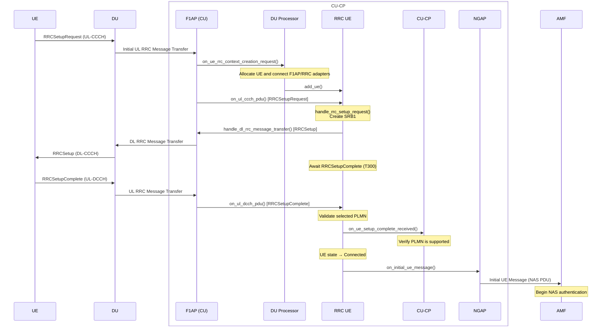

#### Initial Context Setup

Triggered by the AMF after NAS authentication to activate security and optionally set up PDU sessions (TS 38.413 §8.3.1).

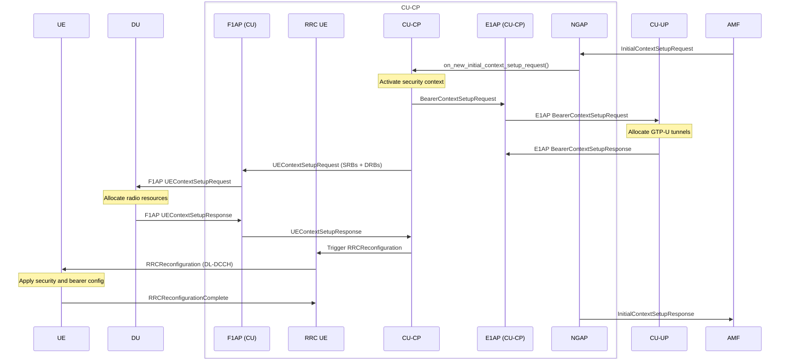

---

### Bearer Management

#### PDU Session Resource Setup

Establishes PDU session resources for a connected UE (TS 38.413 §8.2.1).

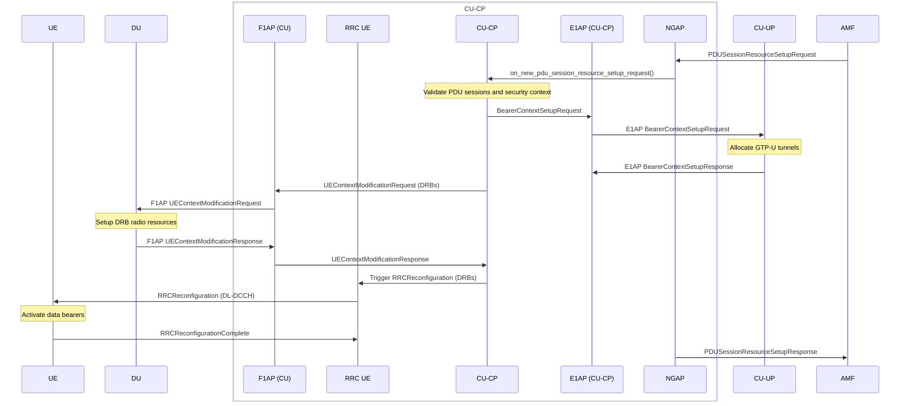

---

### Mobility

#### Intra-gNB (Inter-DU) Handover

Moves a UE between two DUs connected to the same CU-CP without involving the AMF or any peer gNB (TS 38.300 §9.2.3.2). The CU-CP sets up the UE context in the target DU while the UE is still connected to the source, sends the RRC reconfiguration through the source DU, then releases the source context once the UE completes the handover.

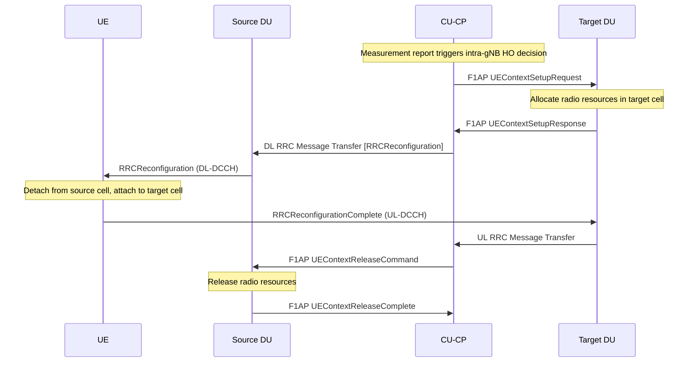

#### RRC Reestablishment

Re-establishes the RRC connection after a radio link failure (TS 38.331 §5.3.7). The CU-CP looks up the old UE context by C-RNTI and PCI, verifies the ShortMAC-I, transfers the security and UP contexts to the new UE, and triggers a context modification at the DU.

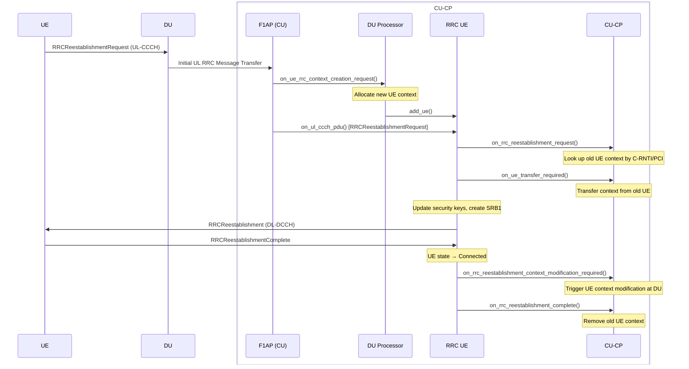

#### RRC Resume

Resumes a UE from RRC Inactive state (TS 38.331 §5.3.13). The CU-CP verifies the ResumeMAC-I, updates the security keys, and restores the UE's suspended context.

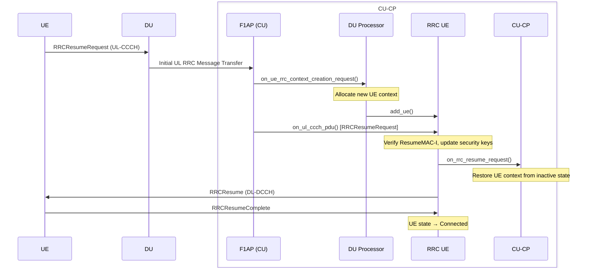

#### Inter-gNB Handover via NGAP — End-to-End

Complete flow for a handover between two gNBs coordinated by the AMF (TS 38.413 §8.4). The source CU-CP prepares the handover, the AMF forwards the request to the target, and the UE executes the handover autonomously. After the UE connects to the target, the AMF switches the downlink path and instructs the source to release the UE context.

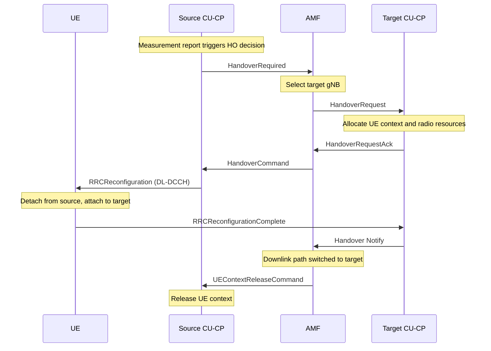

#### Inter-gNB Handover Preparation — NGAP (Source)

Prepares an inter-gNB handover via AMF on the source side (TS 38.413 §8.4.1). Triggered by the Mobility Manager based on measurement reports.

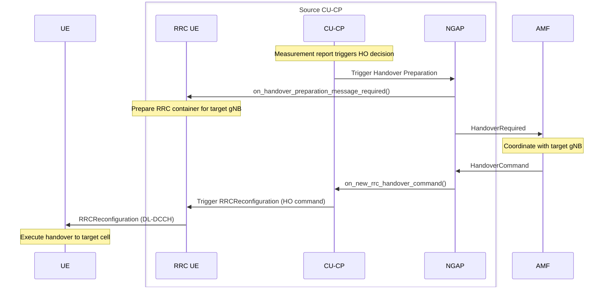

#### Inter-gNB Handover Resource Allocation — NGAP (Target)

Allocates resources on the target gNB side when the AMF sends a Handover Request (TS 38.413 §8.4.2).


#### Inter-gNB Handover via Xn — End-to-End

Complete flow for a direct inter-gNB handover over the Xn interface, without involving the AMF for the preparation phase (TS 38.423 §8.6). After the UE connects to the target, the source transfers PDCP state via SN Status Transfer, and the target CU-CP switches the downlink path with the AMF via Path Switch Request.

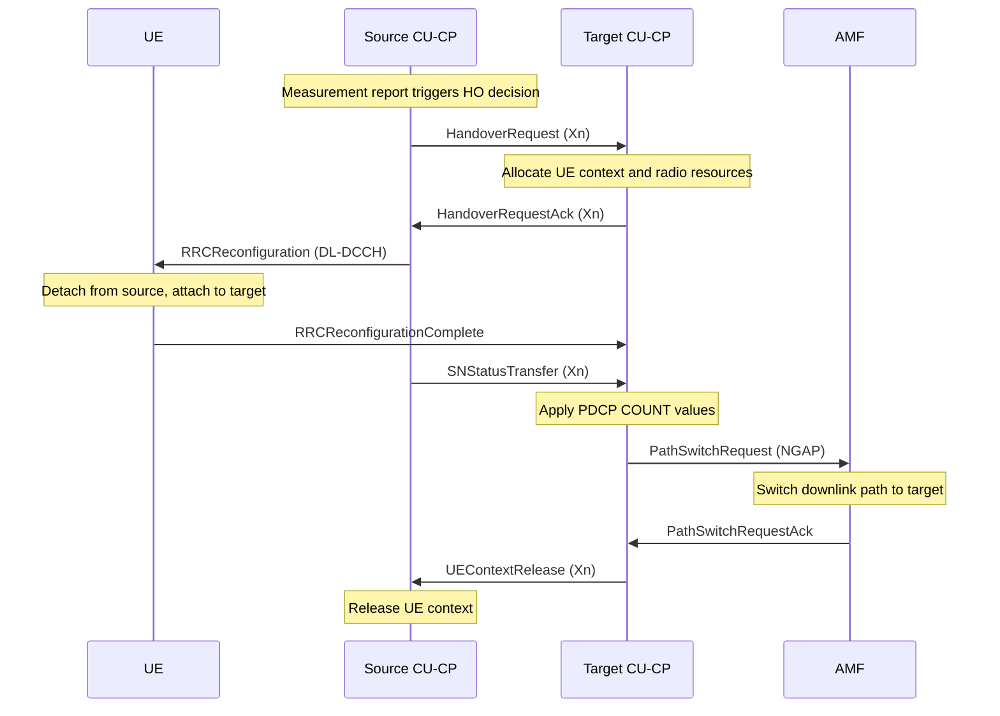

#### Inter-gNB Handover Preparation — Xn (Source)

Prepares an inter-gNB handover directly to the target gNB via the Xn interface, bypassing the AMF (TS 38.423 §8.6.2).


#### Inter-gNB Handover Resource Allocation — Xn (Target)

Allocates resources on the target gNB side when a peer gNB sends a Handover Request over Xn (TS 38.423 §8.6.1).

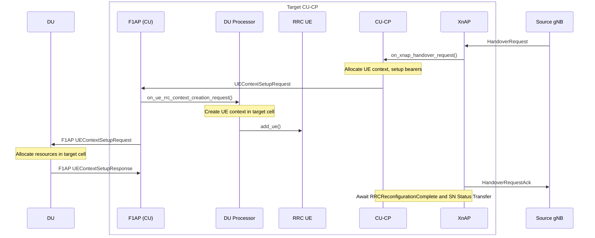

#### SN Status Transfer

Transfers PDCP sequence number state (COUNT values) from the source gNB to the target gNB after the UE executes an Xn handover, ensuring lossless bearer continuity (TS 38.423 §8.8.1).

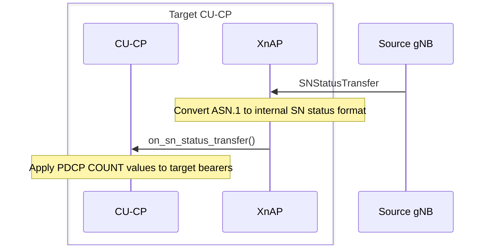

---

### Connection Release

#### UE Context Release

Releases the UE context following an AMF-initiated release command (TS 38.413 §8.3.3).

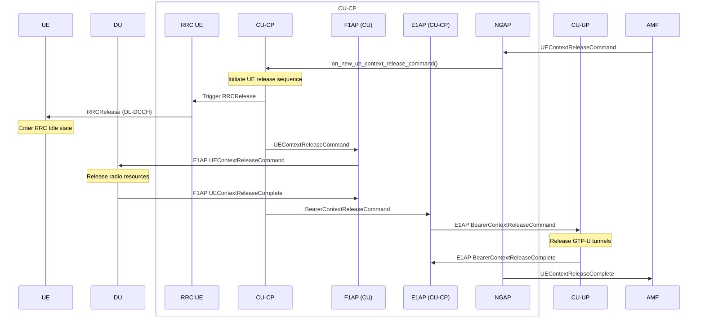

---

### UE Capabilities

#### UE Capability Transfer

Requests and stores UE radio access capabilities (TS 38.331 §5.6.1). Typically triggered after RRC Setup completes.

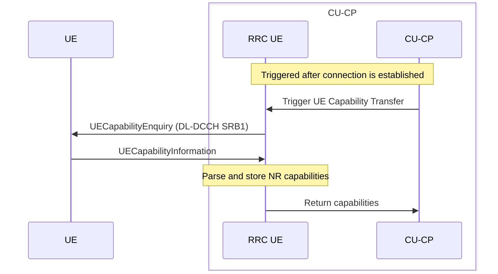

---

### Positioning

#### E-CID Measurement

Requests Enhanced Cell ID (E-CID) measurements from the DU for UE positioning (TS 38.455 §8.8.1). The LMF sends a measurement request to the NRPPa layer, which coordinates with the DU via F1AP positioning procedures.

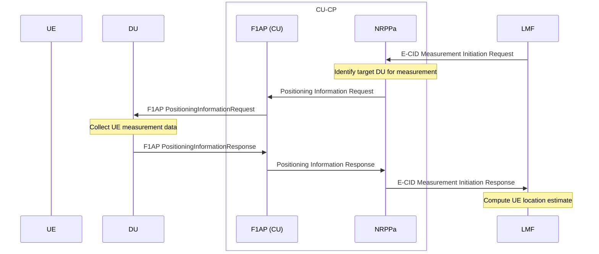

#### Measurement

Coordinates positioning measurements across multiple DUs for a given request (TS 38.455 §8.1.1). The NRPPa layer fans out F1AP Positioning Measurement Requests to each relevant DU, aggregates the results, and returns them to the LMF.

```mermaid
sequenceDiagram
    participant DU as DU (one per TRP)
    box CU-CP
        participant F1AP as F1AP (CU)
        participant NRPPa
    end
    participant LMF

    LMF->>NRPPa: Measurement Request
    Note over NRPPa: Create measurement context, allocate RAN Meas ID
    loop For each DU / TRP
        NRPPa->>F1AP: Positioning Measurement Request
        F1AP->>DU: F1AP PositioningMeasurementRequest
        Note over DU: Perform RSTD / RSRP measurements
        DU->>F1AP: F1AP PositioningMeasurementResponse
        F1AP->>NRPPa: Positioning Measurement Response
    end
    Note over NRPPa: Aggregate results from all DUs
    NRPPa->>LMF: Measurement Response
```

#### Positioning Information Exchange

Retrieves SRS configuration and positioning-related information for a UE from its serving DU (TS 38.455 §8.10.1).

```mermaid
sequenceDiagram
    participant UE
    participant DU
    box CU-CP
        participant F1AP as F1AP (CU)
        participant NRPPa
    end
    participant LMF

    LMF->>NRPPa: Positioning Information Request
    NRPPa->>F1AP: Positioning Information Request
    F1AP->>DU: F1AP PositioningInformationRequest
    Note over DU: Collect UE SRS and positioning config
    DU->>F1AP: F1AP PositioningInformationResponse
    F1AP->>NRPPa: Positioning Information Response
    NRPPa->>LMF: Positioning Information Response
```

#### Positioning Activation

Activates semi-persistent or aperiodic SRS transmission at the DU for a UE, enabling uplink reference signal measurements (TS 38.455 §8.9.1).

```mermaid
sequenceDiagram
    participant UE
    participant DU
    box CU-CP
        participant F1AP as F1AP (CU)
        participant NRPPa
    end
    participant LMF

    LMF->>NRPPa: Positioning Activation Request
    NRPPa->>F1AP: Positioning Activation Request
    F1AP->>DU: F1AP PositioningActivationRequest
    Note over DU: Configure and activate SRS transmission
    DU->>F1AP: F1AP PositioningActivationResponse
    F1AP->>NRPPa: Positioning Activation Response
    NRPPa->>LMF: Positioning Activation Response
    Note over UE: Begins transmitting SRS
```

#### TRP Information Exchange

Retrieves Transmission/Reception Point (TRP) information from connected DUs (TS 38.455 §8.7.1). If the requested TRP IDs are unknown or the list is empty, the NRPPa layer requests the information from the CU-CP, which aggregates it across all DUs.

```mermaid
sequenceDiagram
    participant DU
    box CU-CP
        participant F1AP as F1AP (CU)
        participant CUCPP as CU-CP
        participant NRPPa
    end
    participant LMF

    LMF->>NRPPa: TRP Information Request
    alt TRP IDs known
        NRPPa->>F1AP: TRP Information Request
        F1AP->>DU: F1AP TRPInformationRequest
        Note over DU: Return TRP geometry and capabilities
        DU->>F1AP: F1AP TRPInformationResponse
        F1AP->>NRPPa: TRP Information Response
    else TRP IDs unknown or empty
        NRPPa->>CUCPP: on_trp_information_request()
        Note over CUCPP: Aggregate TRP info from all DUs via F1AP
        CUCPP->>NRPPa: TRP Information
    end
    NRPPa->>LMF: TRP Information Response
```
