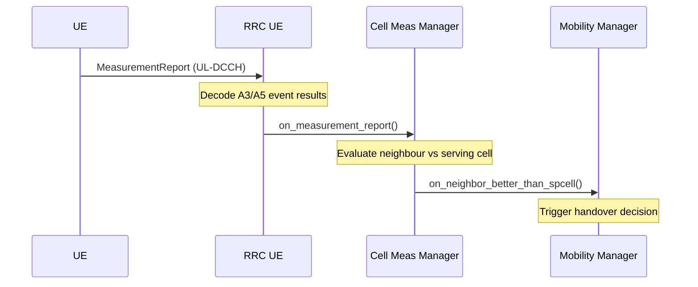
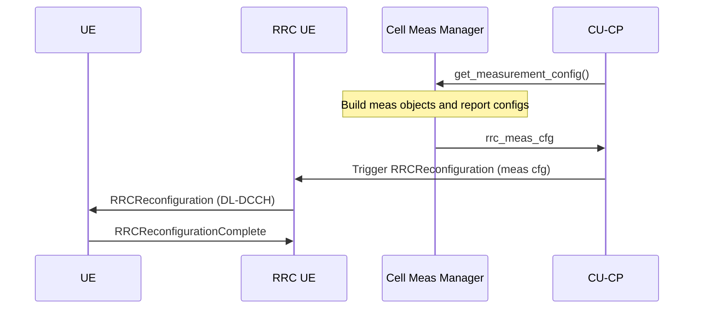

# Cell Measurement Manager

The Cell Measurement Manager generates and evaluates RRC measurement configurations for connected UEs (TS 38.331 §5.5). It translates the configured neighbour cell topology into `rrc_meas_cfg` structures (measurement objects, report configurations, and measurement IDs) that are delivered to UEs via `RRCReconfiguration`. When a UE reports that a neighbour cell is stronger than its serving cell, the Cell Measurement Manager notifies the Mobility Manager to trigger a handover decision.

Responsibilities:

- Build `rrc_meas_cfg` from serving and neighbour cell configuration for each UE.
- Track per-UE measurement context (active measurement objects and IDs).
- Evaluate incoming measurement reports and detect neighbour-better-than-serving-cell events.
- Notify the Mobility Manager via `cell_meas_mobility_manager_notifier` when a handover candidate is identified.

The public contract is expressed through `include/ocudu/cu_cp/cell_meas_manager.h`.

---

## Message Flow

### Measurement Report Evaluation

A UE in RRC Connected state sends `MeasurementReport` messages when configured event conditions (e.g. A3: neighbour becomes offset better than serving cell) are triggered (TS 38.331 §5.5.5). The RRC UE layer forwards the decoded results to the Cell Measurement Manager, which checks whether any reported neighbour cell exceeds the serving cell quality threshold and, if so, triggers a handover decision.

### Measurement Configuration Update

When a UE's serving cell changes or a new neighbour is configured, the Cell Measurement Manager recalculates the measurement configuration (TS 38.331 §5.5.2) and the CU-CP delivers it to the UE via `RRCReconfiguration`.

