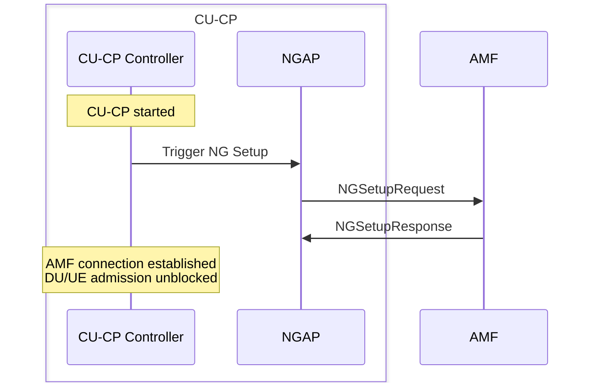
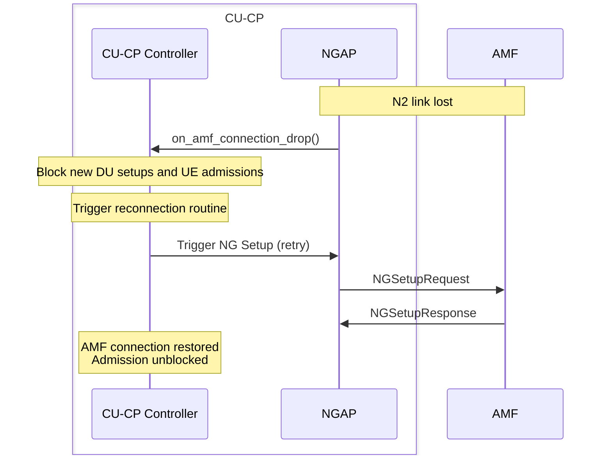

# CU-CP Controller

The CU-CP Controller manages the lifecycle of all remote node connections (AMF, DU, CU-UP, XN-C peer) and enforces admission control for new UE connections. It owns a dedicated connection manager for each interface type and tracks whether critical connections (especially the AMF N2 link) are available before allowing DU setup requests or new UE admissions.

Responsibilities:

- Track the connection status of all AMF, DU, CU-UP, and XN-C peer associations.
- Drive the NG Setup procedure on startup and reconnect automatically after N2 link loss.
- Gate DU F1 Setup requests and new UE admissions on AMF availability.
- Provide the external handler interfaces (`get_f1c_handler()`, `get_e1_handler()`, `get_xnc_handler()`) for the CU-CP's external connections.

The public contract is expressed through `include/ocudu/cu_cp/cu_cp.h`.

---

## Procedures

| Procedure | File | 3GPP reference |
|-----------|------|----------------|
| AMF Connection Setup | `amf_connection_manager.cpp` | TS 38.413 §8.7.1 |
| AMF Reconnection | `amf_connection_manager.cpp` | TS 38.413 §8.7.1 |
| AMF Connection Loss | `amf_connection_manager.cpp` | TS 38.413 §8.7.4 |

### AMF Connection Setup

On startup the CU-CP Controller runs the NG Setup procedure (TS 38.413 §8.7.1). DU F1 Setups and new UE connections are held back until NG Setup completes successfully.

### AMF Connection Loss

When the N2 link goes down the CU-CP Controller blocks new admissions and initiates recovery. The NG Reset procedure (TS 38.413 §8.7.4) clears the AMF-side state; the controller then retries NG Setup.

