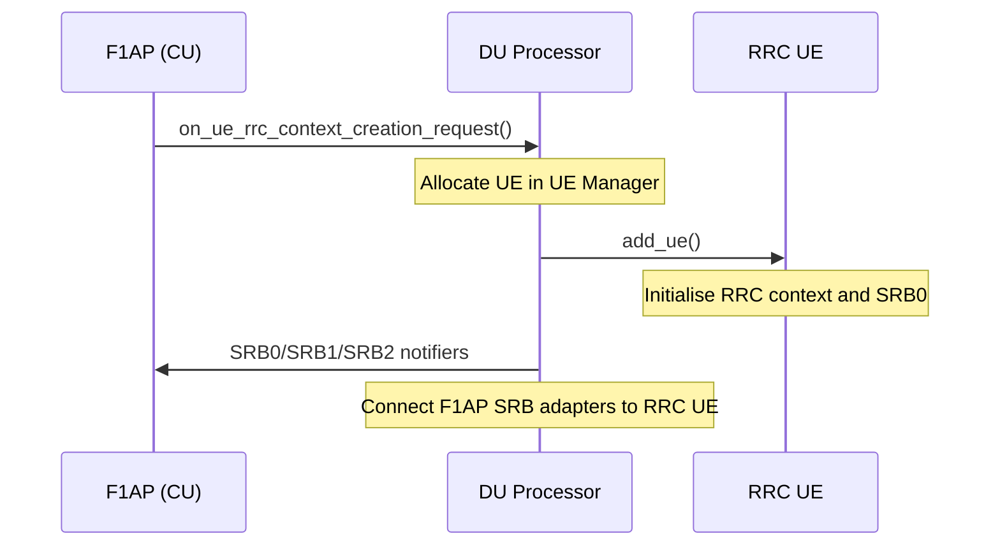
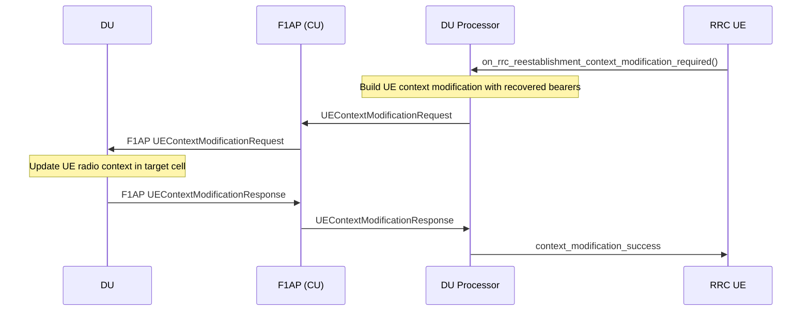

# DU Processor

The DU Processor is the CU-CP component responsible for managing a single connected DU. One `du_processor_impl` instance is created per DU when the F1 Setup completes. It owns the F1AP entity and the RRC handler for that DU and acts as the coordination point between them.

Responsibilities:

- Own and drive the F1AP CU instance for the DU.
- Create and remove RRC UE instances when UEs attach or detach from the DU.
- Wire up the per-UE adapters that connect F1AP SRB bearers to the RRC UE layer.
- Handle UE RRC context transfer requests during handover and reestablishment.
- Forward DU configuration update requests to the F1AP layer (`gnb_cu_configuration_update`).

The public contract is expressed through `include/ocudu/cu_cp/cu_cp_types.h` and the `du_processor` interface. Inbound events from F1AP arrive via `f1ap_du_processor_notifier`; outbound events toward the CU-CP go via `du_processor_notifier`.

---

## Procedures

| Procedure | File | 3GPP reference |
|-----------|------|----------------|
| UE RRC Context Creation | *(inline in `du_processor_impl.cpp`)* | TS 38.473 §8.3.1 |
| Reestablishment Context Modification | `reestablishment_context_modification_routine.cpp` | TS 38.331 §5.3.7 |

### UE RRC Context Creation

Creates a new RRC UE instance and connects its SRB adapters to the F1AP bearer manager. Called by the F1AP layer when it receives the first UL-CCCH message for a UE.

### Reestablishment Context Modification

Triggered by the RRC Reestablishment procedure after `RRCReestablishmentComplete` is received. The DU Processor issues an F1AP UE Context Modification to re-anchor the UE on the correct DU cell with its recovered bearer configuration.

