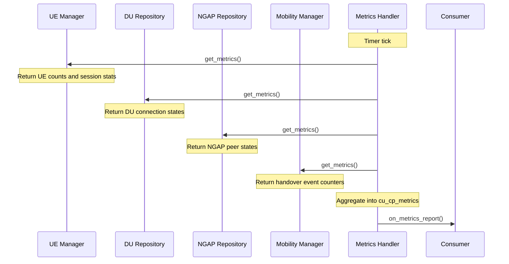

# Metrics Handler

The Metrics Handler aggregates performance counters from the CU-CP's sub-components and delivers periodic reports to registered consumers. It drives reporting sessions via a configurable timer and collects data from the UE Manager, DU repository, NGAP repository, and Mobility Manager on each tick.

Responsibilities:

- Open and close metrics reporting sessions via `metrics_report_session`.
- Collect UE counts, bearer statistics, DU connection states, NGAP peer states, and handover event counters on each timer tick.
- Deliver aggregated `cu_cp_metrics` reports to registered `cu_cp_metrics_report_notifier` consumers.

The public contract is expressed through `include/ocudu/cu_cp/cu_cp_metrics_handler.h`.

---

## Reporting Flow

