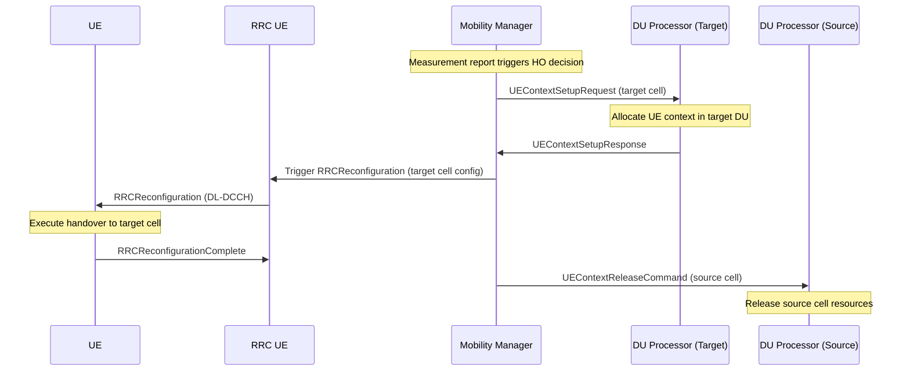
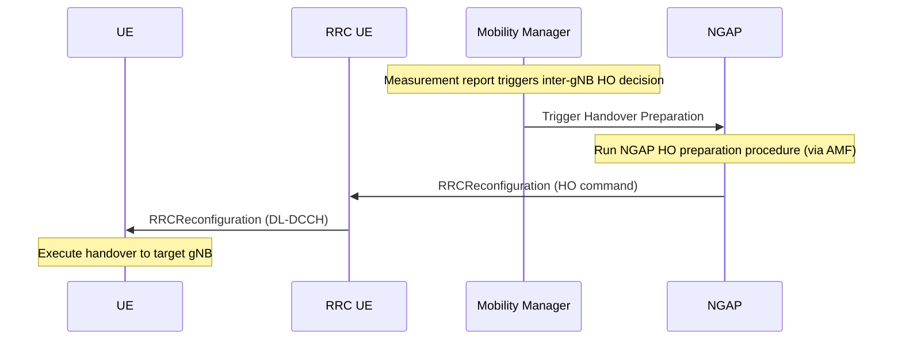
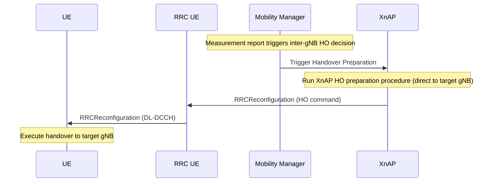
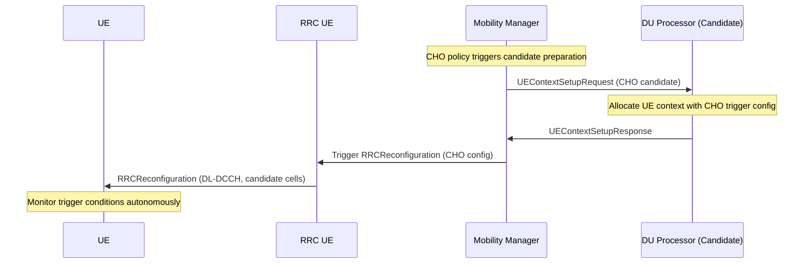

# Mobility Manager

The Mobility Manager orchestrates all UE mobility decisions and handover procedures within the CU-CP. It is notified by the Cell Measurement Manager when a neighbour cell becomes better and decides whether and how to trigger a handover.

Responsibilities:

- Evaluate measurement reports and select the handover target cell.
- Trigger intra-gNB (inter-DU) handovers directly via the DU Processor.
- Trigger inter-gNB handovers via the NGAP or XnAP layer.
- Trigger and manage Conditional Handover (CHO) preparation and execution.
- Report handover metrics via `mobility_manager_metrics_handler`.

The Mobility Manager interfaces with:
- `cell_meas_manager` — to receive neighbour-better events.
- `ngap_repository` — to reach the NGAP layer for inter-gNB (N2) handovers.
- `xnap_repository` — to reach the XnAP layer for inter-gNB (Xn) handovers.
- `du_processor_repository` — to reach DU Processors for intra-gNB handovers.
- `ue_manager` — to look up UE contexts.

---

## Procedures

| Procedure | File | 3GPP reference |
|-----------|------|----------------|
| Intra-gNB (Inter-DU) Handover | `intra_cu_handover_routine.cpp` | TS 38.300 §9.2.3.2 |
| Inter-gNB Handover (NGAP) | `inter_cu_handover_source_routine.cpp` | TS 38.413 §8.4 |
| Inter-gNB Handover (XnAP) | `xnap_source_handover_preparation_procedure.cpp` | TS 38.423 §8.6 |
| Conditional Handover — Preparation | `conditional_handover_source_routine.cpp` | TS 38.331 §5.3.5.3 |
| Conditional Handover — Execution | `conditional_handover_target_routine.cpp` | TS 38.331 §5.3.5.3 |

### Intra-gNB (Inter-DU) Handover

Moves a UE between two DUs connected to the same CU-CP. The Mobility Manager drives an F1AP UE Context Setup on the target DU, then an F1AP UE Context Release on the source DU. No NGAP or XnAP signalling is required.

### Inter-gNB Handover (NGAP)

Hands over a UE to a neighbouring gNB via the AMF. The Mobility Manager initiates the NGAP Handover Preparation procedure; the NGAP layer handles the AMF signalling and delivers the RRC Handover Command.

### Inter-gNB Handover (XnAP)

Hands over a UE to a neighbouring gNB directly over the Xn interface, bypassing the AMF. The Mobility Manager initiates the XnAP Handover Preparation procedure.

### Conditional Handover (CHO) Preparation

Prepares candidate target cells for a Conditional Handover. The Mobility Manager sends an F1AP UE Context Setup to each candidate DU in advance; the UE autonomously executes the handover when the trigger condition is met.

