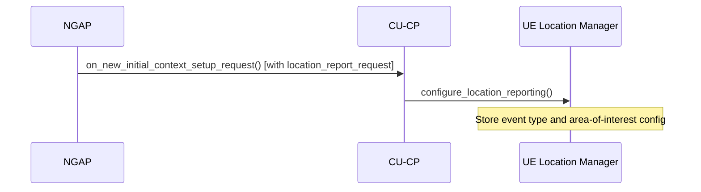
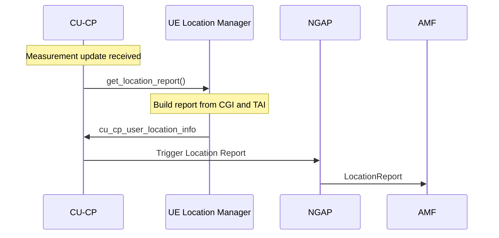

# UE Location Manager

The UE Location Manager handles per-UE location reporting as requested by the AMF via NGAP (TS 38.413 §8.17.1). It validates and stores location report configurations (event types, areas of interest), generates location reports from UE measurement data, and provides location information for inclusion in Xn and NGAP handover requests.

Responsibilities:

- Process `location_report_request` messages from the AMF and store per-UE reporting configuration.
- Generate `cu_cp_user_location_info` from incoming UE measurement updates.
- Provide the current location report request for inclusion in Xn Handover Requests.
- Produce direct (immediate) location reports for NGAP responses.

The public contract is expressed through `include/ocudu/cu_cp/cu_cp_types.h` and the `ue_location_manager` interface.

---

## Message Flow

### Location Reporting Configuration

The AMF requests location reporting as part of the Initial Context Setup or UE Context Modification procedures (TS 38.413 §8.17.1). The CU-CP stores the configuration in the UE Location Manager and applies it to subsequent measurement updates.

### Location Report Generation

When a UE sends a measurement report, the CU-CP updates the UE Location Manager with the new location information and, if the configured trigger condition is met, sends a Location Report to the AMF (TS 38.413 §8.17.2).

