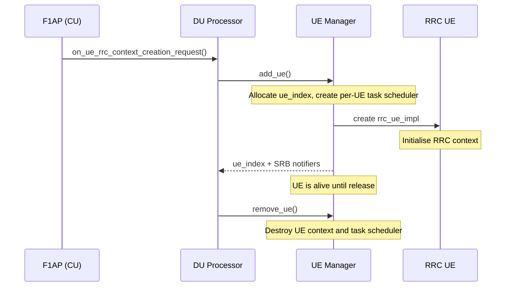
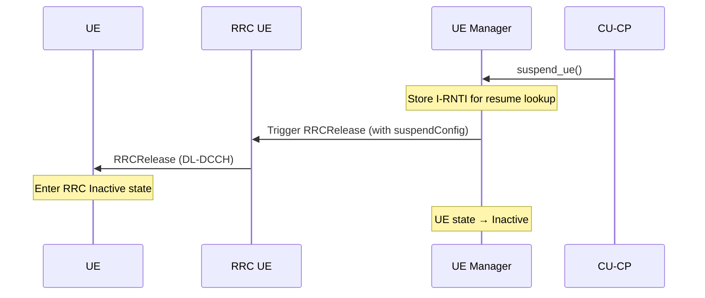

# UE Manager

The UE Manager is the central UE lifecycle manager within the CU-CP. It owns the full collection of UE contexts and is the single point responsible for allocating and removing them.

Responsibilities:

- Allocate new `cu_cp_ue` contexts with a unique `cu_cp_ue_index_t`, and remove them on release.
- Provide UE lookups by PCI / C-RNTI (for reestablishment) and by I-RNTI (for resume).
- Own per-UE task schedulers so that concurrent procedures for the same UE are serialised.
- Enforce PLMN blocking: reject UE allocation if the UE's PLMN is not in the allowed list.
- Expose the RRC, NGAP, and measurement adapter notifiers that other CU-CP layers use to reach a specific UE.

The public contract is expressed through `include/ocudu/cu_cp/cu_cp_ue_messages.h` and the `ue_manager` interface.

---

## Procedures

| Procedure | File | 3GPP reference |
|-----------|------|----------------|
| UE Allocation | *(inline in `ue_manager_impl.cpp`)* | — |
| UE Removal | `ue_removal_routine.cpp` | TS 38.413 §8.3.3 |
| UE Suspend | `ue_suspend_routine.cpp` | TS 38.331 §5.3.11 |

### UE Context Lifecycle

### UE Suspend

Transitions a connected UE to RRC Inactive state (TS 38.331 §5.3.11). The CU-CP sends an `RRCRelease` with a suspend configuration via the RRC layer, stores the UE's I-RNTI for later resume lookup, and marks the context as inactive.

