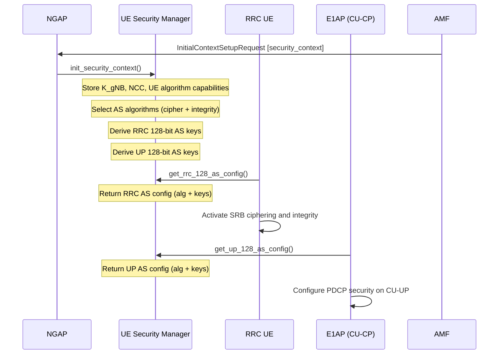
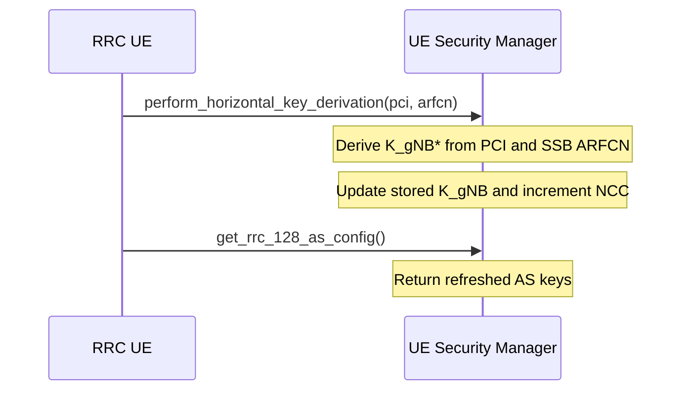

# UE Security Manager

The UE Security Manager holds the per-UE 3GPP NR security context and is the single source of truth for all cryptographic material in the CU-CP. It receives the initial security context from the AMF via NGAP, selects AS ciphering and integrity-protection algorithms according to the configured preference list, and derives the RRC and UP access-stratum (AS) keys used by the RRC and E1AP layers. Key derivation follows TS 33.501 (5G Security Architecture and Procedures).

Responsibilities:

- Store and manage the UE's `security_context` (K_gNB, NCC, supported algorithms).
- Select the AS ciphering and integrity algorithms from the CU-CP preference list and AMF capabilities.
- Derive RRC and UP 128-bit AS keys (`sec_128_as_config`) for use by the RRC layer (ciphering, integrity) and CU-UP (PDCP).
- Support horizontal key derivation (K_gNB* from PCI and ARFCN) for handover and reestablishment.
- Provide the current security context and NCC to NGAP for Path Switch and Handover responses.

The public contract is expressed through three role-based interfaces in `include/ocudu/cu_cp/cu_cp_types.h`:
- `rrc_ue_security_manager` — used by the RRC UE layer
- `ngap_ue_security_manager` — used by the NGAP layer
- `up_ue_security_manager` — used by the E1AP / CU-UP layer

---

## Key Derivation Flow

Triggered by the Initial Context Setup procedure (TS 38.413 §8.3.1). The AS keys are derived from K_gNB as specified in TS 33.501 Annex A.4; algorithm selection follows TS 38.331 §5.3.4.

## Horizontal Key Derivation (Handover / Reestablishment)

During handover or reestablishment, new AS keys are derived from the current K_gNB using the target cell's PCI and SSB ARFCN (TS 33.501 Annex A.11).

