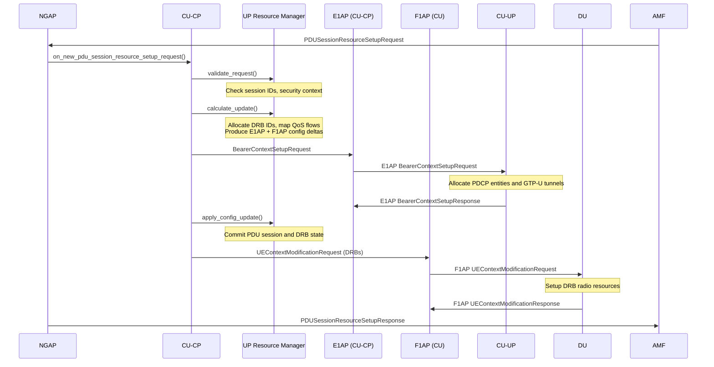

# UP Resource Manager

The UP Resource Manager maintains the per-UE user-plane resource state: all active PDU sessions and their DRB-to-QoS-flow mappings. It validates NGAP PDU session requests, allocates DRB IDs, computes the incremental E1AP and F1AP configuration updates needed to realise those sessions, and applies the results once bearer setup succeeds.

Responsibilities:

- Validate incoming `ngap_pdu_session_resource_setup/modify/release_request` messages against the current UE state.
- Allocate DRB IDs and map QoS flows to DRBs according to 5QI and ARP.
- Compute `up_config_update` structures that describe what must be created, modified, or deleted in E1AP (CU-UP) and F1AP (DU).
- Apply successful E1AP bearer context responses to update internal PDU session and DRB state.
- Recycle DRB IDs after security key refresh (NCC reset following Path Switch or Handover).

The public contract is expressed through `include/ocudu/cu_cp/up_resource_manager.h`.

---

## PDU Session Resource Setup Flow

The UP Resource Manager is called synchronously as part of the PDU Session Resource Setup routine (TS 38.413 §8.2.1). It sits between NGAP (which delivers the AMF request) and E1AP/F1AP (which carry out the radio and tunnelling configuration). QoS flow to DRB mapping follows TS 38.300 §5.7.

