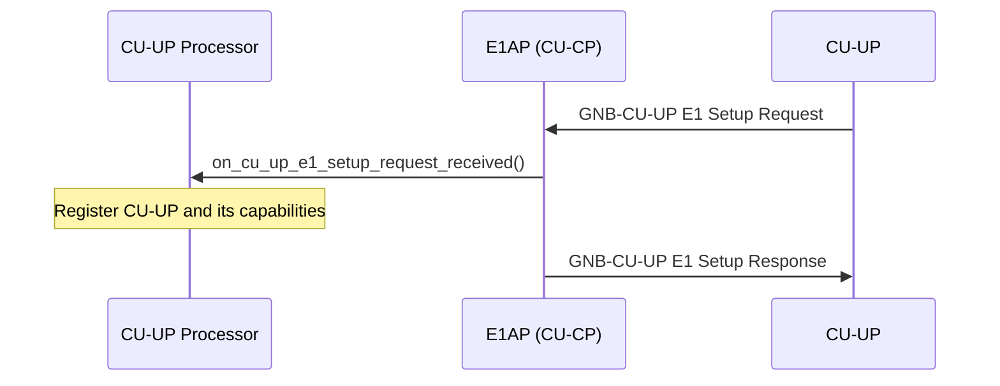
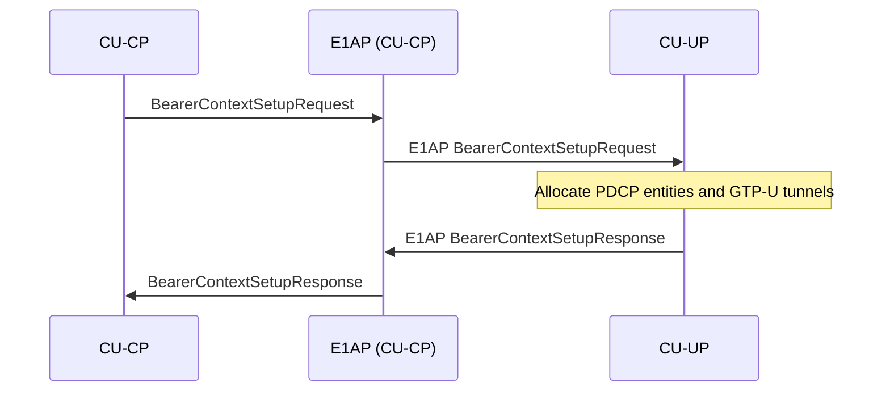
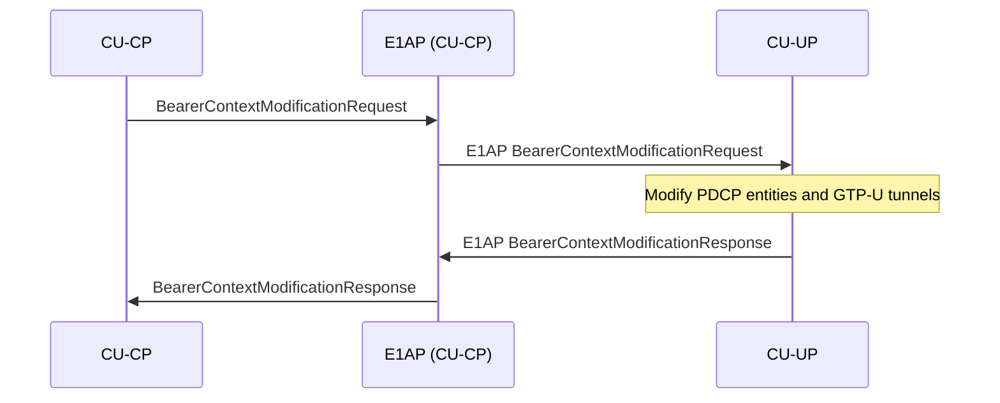
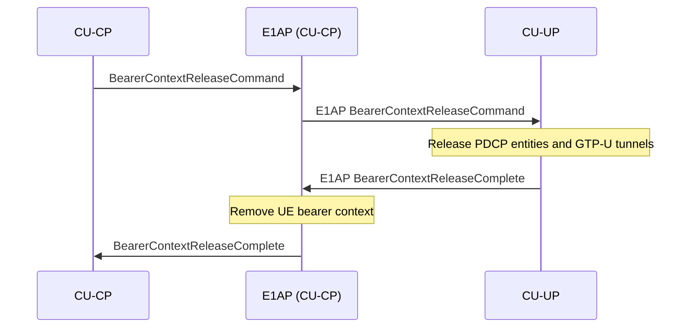

# E1AP (CU-CP side)

The E1AP CU-CP layer implements the E1 interface between the CU-CP and each connected CU-UP (TS 37.483). It maintains one `e1ap_cu_cp_impl` instance per CU-UP, owned by the CU-UP Processor.

Responsibilities:

- Handle the E1 association lifecycle (E1 Setup, E1 Reset, E1 Release).
- Send bearer context requests to the CU-UP and correlate responses via a transaction manager.
- Translate between E1AP ASN.1 message types and the CU-CP's internal bearer context types.
- Notify the CU-UP Processor of incoming CU-UP-initiated messages via `e1ap_cu_cp_notifier`.

The public contract is expressed through `include/ocudu/e1ap/cu_cp/e1ap_cu_cp.h`.

---

## Procedures

### Association Management

Procedures that establish and reset the E1 connection between the CU-CP and a CU-UP.

| Procedure | File | 3GPP reference |
|-----------|------|----------------|
| E1 Setup | *(CU-UP initiates; handled in `e1ap_cu_cp_impl.cpp`)* | TS 37.483 §8.2.1 |
| E1 Reset | `cu_cp_e1_reset_procedure.cpp` | TS 37.483 §8.6.1 |
| E1 Release | `e1_release_procedure.cpp` | TS 37.483 §8.6.2 |

#### E1 Setup

The CU-UP initiates the E1 association by sending a GNB-CU-UP E1 Setup Request (TS 37.483 §8.2.1). The E1AP CU-CP layer forwards it to the CU-UP Processor, which registers the CU-UP and returns its capabilities. Retries with the CU-CP-provided back-off timer on failure.

### Bearer Context Management

Procedures that create, modify, and release PDCP entities and GTP-U tunnels on the CU-UP for a given UE.

| Procedure | File | 3GPP reference |
|-----------|------|----------------|
| Bearer Context Setup | `bearer_context_setup_procedure.cpp` | TS 37.483 §8.3.1 |
| Bearer Context Modification | `bearer_context_modification_procedure.cpp` | TS 37.483 §8.3.2 |
| Bearer Context Release | `bearer_context_release_procedure.cpp` | TS 37.483 §8.3.3 |

#### Bearer Context Setup

Establishes bearer contexts (PDCP + GTP-U tunnels) on the CU-UP for a UE's PDU sessions (TS 37.483 §8.3.1).

#### Bearer Context Modification

Modifies existing bearer contexts on the CU-UP, for example to add or remove DRBs (TS 37.483 §8.3.2).

#### Bearer Context Release

Releases all bearer contexts for a UE on the CU-UP (TS 37.483 §8.3.3).

