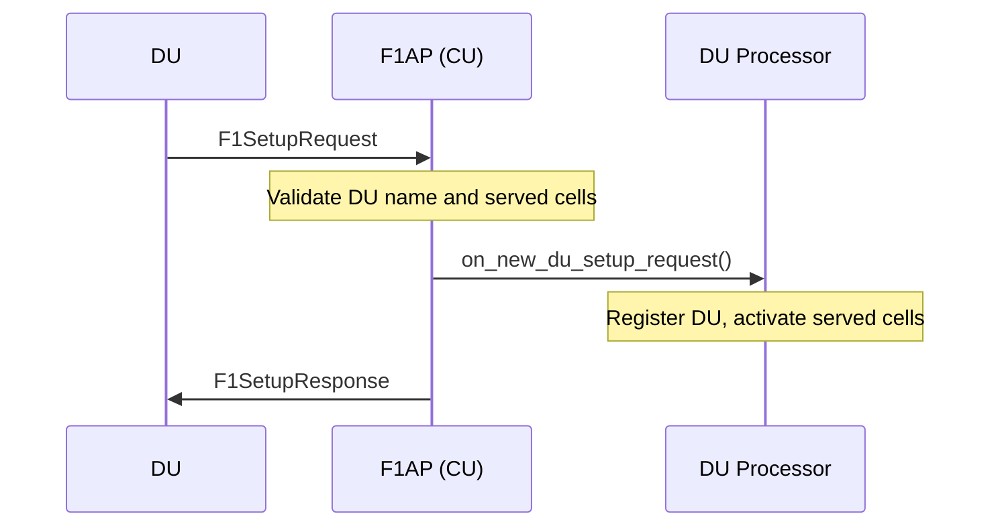
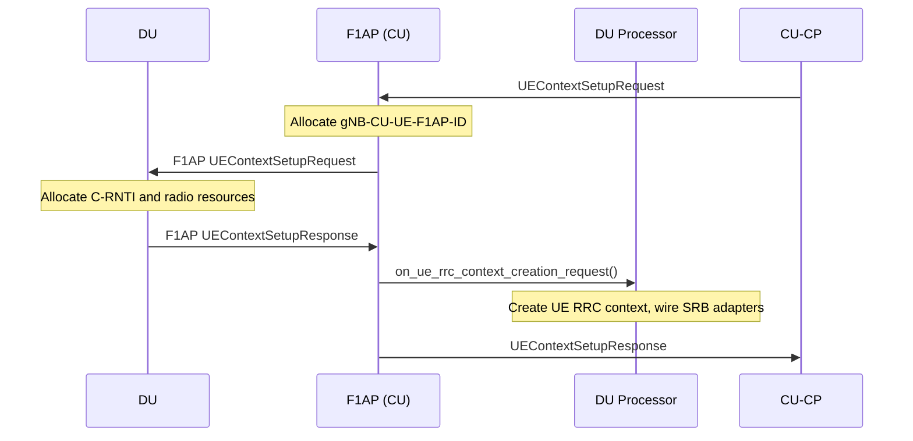
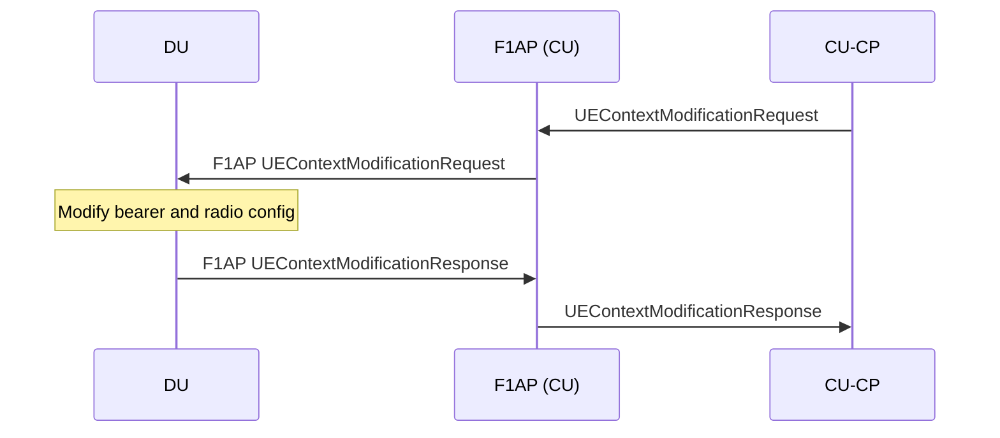
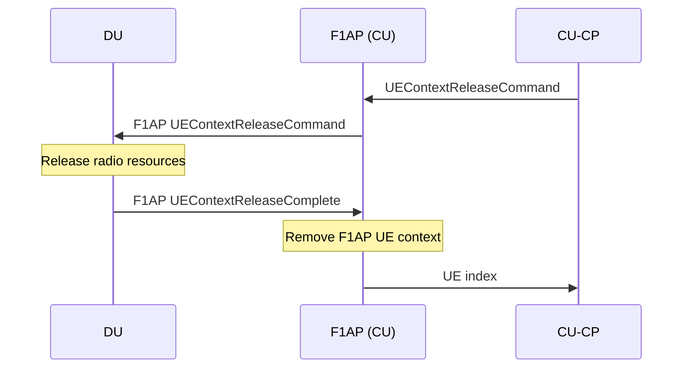
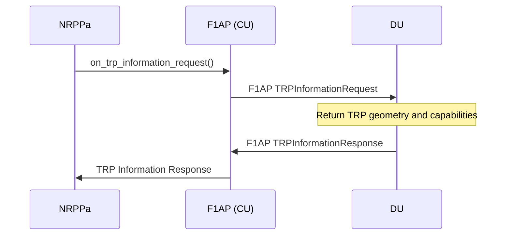
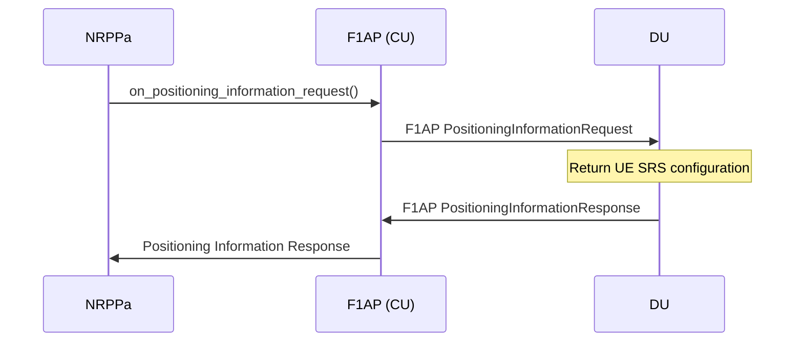
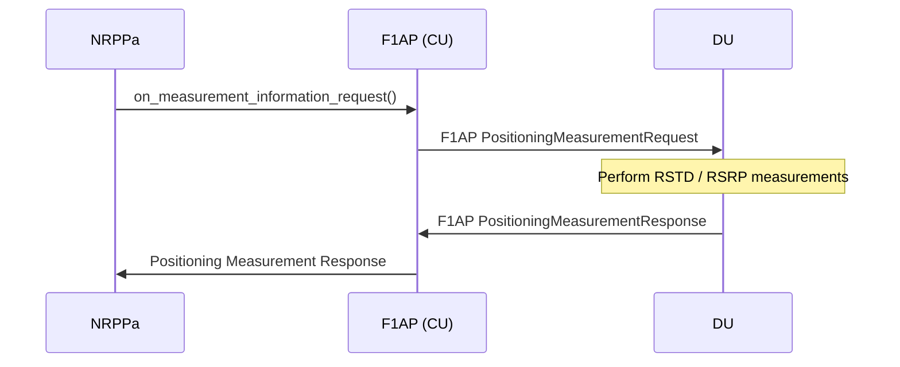
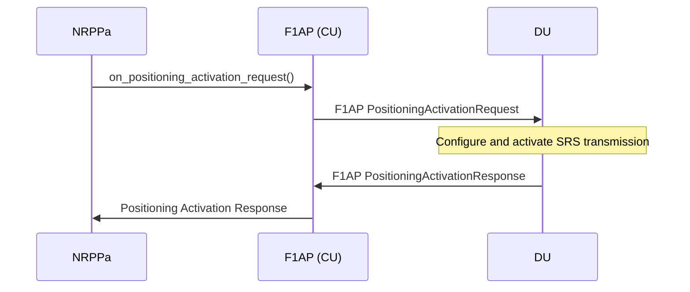

# F1AP (CU-CP side)

The F1AP CU-CP layer implements the F1-c control plane interface between the CU-CP and each connected DU (TS 38.473). It is the first point of contact for all uplink F1AP messages from the DU and the last hop for all downlink F1AP messages toward the DU.

Responsibilities:

- Maintain one `f1ap_cu_impl` instance per connected DU, each with its own message notifier and UE context list.
- Allocate and manage gNB-CU-UE-F1AP-IDs for each UE.
- Dispatch incoming F1AP PDUs to the appropriate procedure or UE bearer handler.
- On the first UL-CCCH message for a UE, notify the DU Processor to create the UE RRC context and wire up the SRB adapters.
- Forward UL-DCCH PDUs to the RRC UE transaction manager to complete awaiting procedure coroutines.

The public contract is expressed through `include/ocudu/f1ap/cu_cp/f1ap_cu.h`. The DU Processor is notified of UE context events via `f1ap_du_processor_notifier`.

---

## Procedures

### Association Management

Procedures that establish, update, and tear down the F1 connection between a DU and the CU-CP.

| Procedure | File | 3GPP reference |
|-----------|------|----------------|
| F1 Setup | `f1_setup_procedure.cpp` | TS 38.473 §8.2.3 |
| gNB-CU Configuration Update | `gnb_cu_configuration_update_procedure.cpp` | TS 38.473 §8.2.5 |
| F1 Removal | `f1_removal_procedure.cpp` | TS 38.473 §8.2.8 |

#### F1 Setup

Handles a DU connecting to the CU-CP for the first time (TS 38.473 §8.2.3). This is a synchronous handler (not a coroutine): the F1AP layer validates the request, forwards it to the DU Processor, and replies immediately.

### UE Context Management

Procedures that create, modify, and release per-UE contexts on the DU.

| Procedure | File | 3GPP reference |
|-----------|------|----------------|
| UE Context Setup | `ue_context_setup_procedure.cpp` | TS 38.473 §8.3.1 |
| UE Context Modification | `ue_context_modification_procedure.cpp` | TS 38.473 §8.3.2 |
| UE Context Release | `ue_context_release_procedure.cpp` | TS 38.473 §8.3.3 |

#### UE Context Setup

Allocates a new UE context on the DU and optionally creates the UE RRC context in the CU-CP (TS 38.473 §8.3.1). Used during connection establishment and handover target-cell setup.

#### UE Context Modification

Modifies an existing UE context on the DU, for example to add or release DRBs (TS 38.473 §8.3.2).

#### UE Context Release

Releases the UE context on the DU and returns the UE index to the caller (TS 38.473 §8.3.3).

### Positioning

Procedures that exchange positioning-related information between the CU-CP and the DU on behalf of the NRPPa layer. Each procedure is driven by NRPPa and relayed to the DU via F1AP. See [NRPPa](../../nrppa/README.md) for the end-to-end positioning flow.

| Procedure | File | 3GPP reference |
|-----------|------|----------------|
| TRP Information Exchange | `f1ap_trp_information_exchange_procedure.cpp` | TS 38.473 §8.13.8 |
| Positioning Information Exchange | `f1ap_positioning_information_exchange_procedure.cpp` | TS 38.473 §8.13.9 |
| Positioning Measurement | `f1ap_positioning_measurement_procedure.cpp` | TS 38.473 §8.13.3 |
| Positioning Activation | `f1ap_positioning_activation_procedure.cpp` | TS 38.473 §8.13.10 |

#### TRP Information Exchange

Requests Transmission/Reception Point (TRP) geometry and capability information from the DU (TS 38.473 §8.13.8).

#### Positioning Information Exchange

Retrieves SRS configuration and positioning-related information for a UE from its serving DU (TS 38.473 §8.13.9).

#### Positioning Measurement

Requests uplink reference signal measurements (RSTD / RSRP) from the DU for a given UE (TS 38.473 §8.13.3).

#### Positioning Activation

Activates semi-persistent or aperiodic SRS transmission at the DU for a UE (TS 38.473 §8.13.10).

