# NGAP

The NGAP layer implements the N2 control plane interface between the CU-CP and the AMF (TS 38.413). It maintains one `ngap_impl` instance per AMF connection and one `ngap_ue_context` per connected UE, identified by the RAN-UE-NGAP-ID / AMF-UE-NGAP-ID pair.

Responsibilities:

- Manage the NG association lifecycle (NG Setup, NG Reset).
- Dispatch incoming NGAP PDUs to per-UE or per-association procedure coroutines.
- Translate between NGAP message types and the CU-CP's internal message types via `ngap_cu_cp_notifier`.
- Forward NAS PDUs to the RRC UE layer via `ngap_rrc_ue_notifier`.
- Report PDU session setup/failure metrics via `ngap_metrics_aggregator`.

The public contract is expressed through `include/ocudu/ngap/ngap.h`.

---

## Procedures

### Association Management

Procedures that establish and reset the N2 connection between the CU-CP and the AMF.

| Procedure | File | 3GPP reference |
|-----------|------|----------------|
| NG Setup | `ng_setup_procedure.cpp` | TS 38.413 §8.7.1 |
| NG Reset | `ng_reset_procedure.cpp` | TS 38.413 §8.7.4 |

#### NG Setup

Establishes the N2 association with the AMF (TS 38.413 §8.7.1). Retries with the AMF-provided back-off timer up to a configurable maximum.

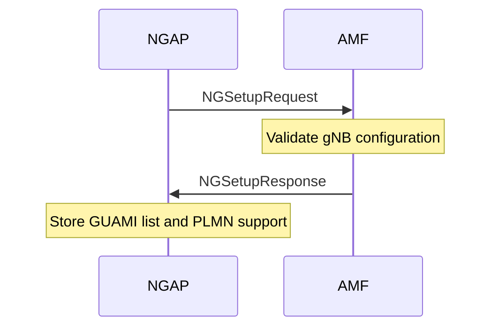

#### NG Reset

Resets the NG association and all associated UE state (TS 38.413 §8.7.4).

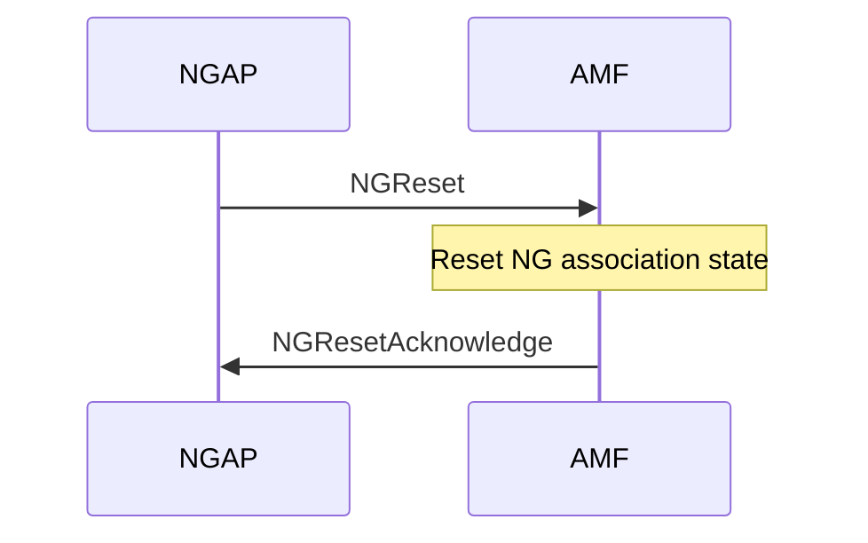

### NAS Transport

Procedure that delivers downlink NAS PDUs from the AMF to the UE via the RRC layer.

| Procedure | File | 3GPP reference |
|-----------|------|----------------|
| DL NAS Transfer | `ngap_dl_nas_message_transfer_procedure.cpp` | TS 38.413 §8.6.2 |

#### DL NAS Transfer

Forwards a downlink NAS PDU from the AMF to the UE via the RRC layer (TS 38.413 §8.6.2). Optionally triggers a UE Radio Capability Info Indication if the AMF requests it.

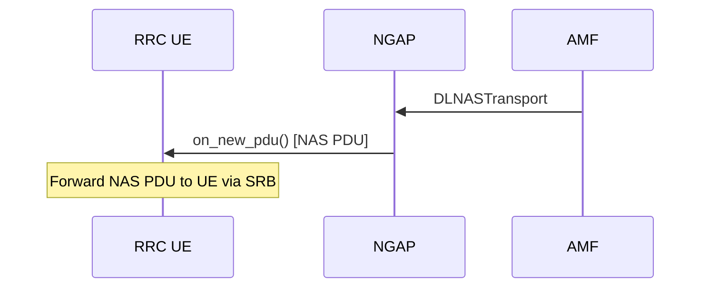

### UE Context Management

Procedures that create, modify, and release the UE context at the AMF.

| Procedure | File | 3GPP reference |
|-----------|------|----------------|
| Initial Context Setup | `ngap_initial_context_setup_procedure.cpp` | TS 38.413 §8.3.1 |
| UE Context Modification | `ngap_ue_context_modification_procedure.cpp` | TS 38.413 §8.3.2 |
| UE Context Release | `ngap_ue_context_release_procedure.cpp` | TS 38.413 §8.3.3 |

#### Initial Context Setup

Activates the UE's security context and optionally establishes PDU sessions, triggered by the AMF after NAS authentication (TS 38.413 §8.3.1).

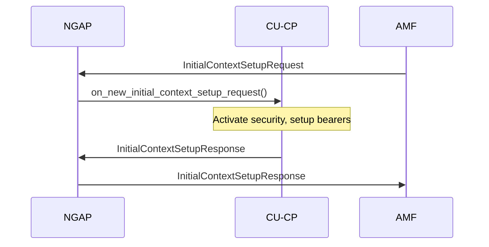

#### UE Context Modification

Modifies an existing UE context at the request of the AMF, for example to update security or bearer configuration (TS 38.413 §8.3.2).

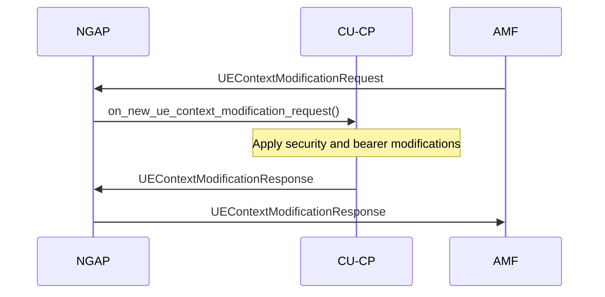

#### UE Context Release

Releases the UE context following an AMF-initiated release command (TS 38.413 §8.3.3).

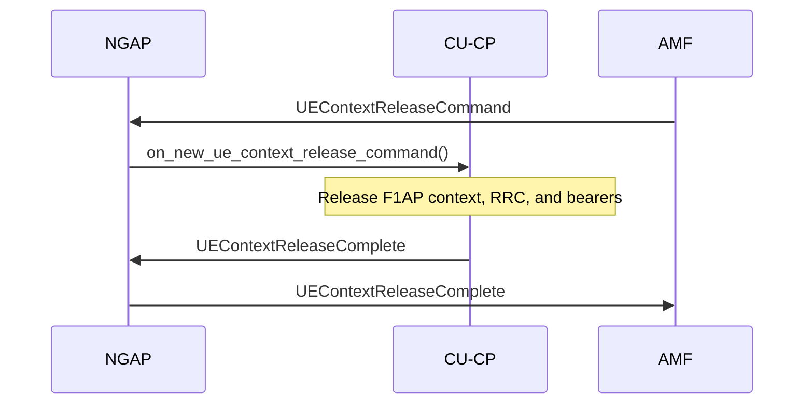

### PDU Session Management

Procedures that establish, modify, and release user-plane PDU sessions.

| Procedure | File | 3GPP reference |
|-----------|------|----------------|
| PDU Session Resource Setup | `ngap_pdu_session_resource_setup_procedure.cpp` | TS 38.413 §8.2.1 |
| PDU Session Resource Modify | `ngap_pdu_session_resource_modify_procedure.cpp` | TS 38.413 §8.2.3 |
| PDU Session Resource Release | `ngap_pdu_session_resource_release_procedure.cpp` | TS 38.413 §8.2.2 |

#### PDU Session Resource Setup

Establishes PDU session resources for a connected UE (TS 38.413 §8.2.1).

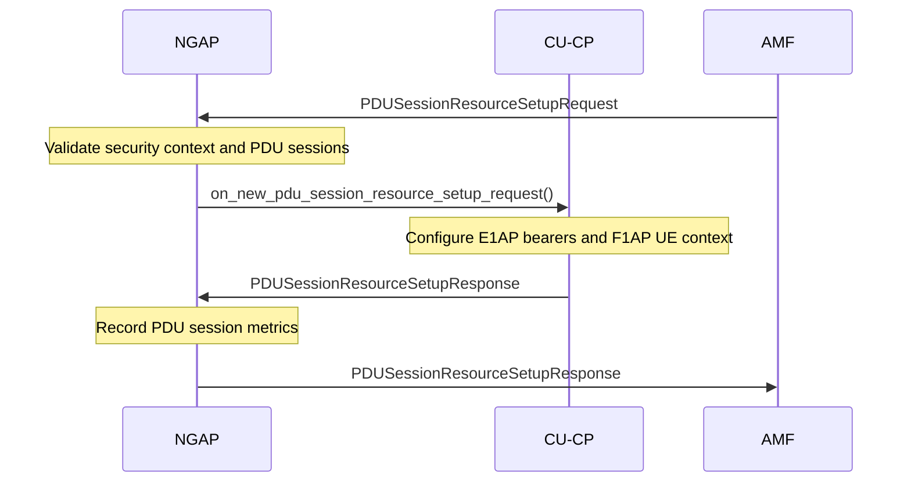

#### PDU Session Resource Modify

Modifies existing PDU session resources at the request of the AMF (TS 38.413 §8.2.3).

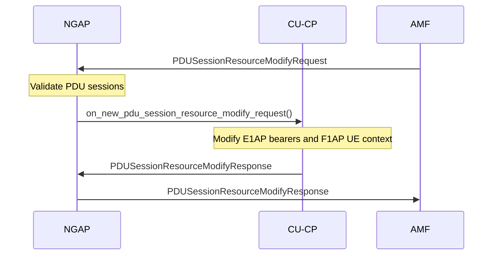

#### PDU Session Resource Release

Releases PDU session resources following an AMF command (TS 38.413 §8.2.2).

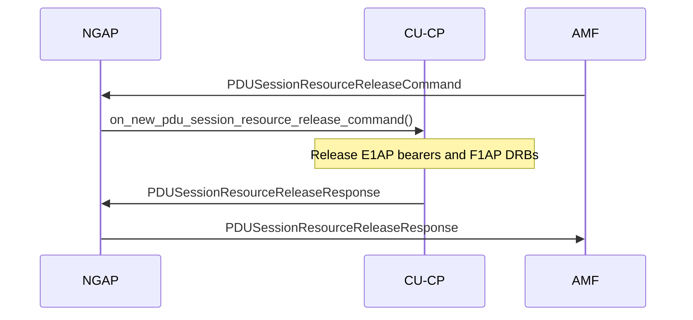

### Handover

Procedures that coordinate inter-gNB handover via the AMF. See also [XnAP](../../xnap/README.md) for Xn-based direct handover without AMF involvement.

| Procedure | File | 3GPP reference |
|-----------|------|----------------|
| Handover Preparation | `ngap_handover_preparation_procedure.cpp` | TS 38.413 §8.4.1 |
| Handover Resource Allocation | `ngap_handover_resource_allocation_procedure.cpp` | TS 38.413 §8.4.2 |
| Path Switch | `ngap_path_switch_procedure.cpp` | TS 38.413 §8.4.4 |
| DL RAN Status Transfer | `ngap_dl_ran_status_transfer_procedure.cpp` | TS 38.413 §8.4.5 |

#### Handover — End-to-End

Complete NGAP-based inter-gNB handover flow (TS 38.413 §8.4). The source sends a Handover Required to the AMF, which selects the target and forwards the request. After the UE attaches to the target, the target notifies the AMF, which instructs the source to release the UE context.

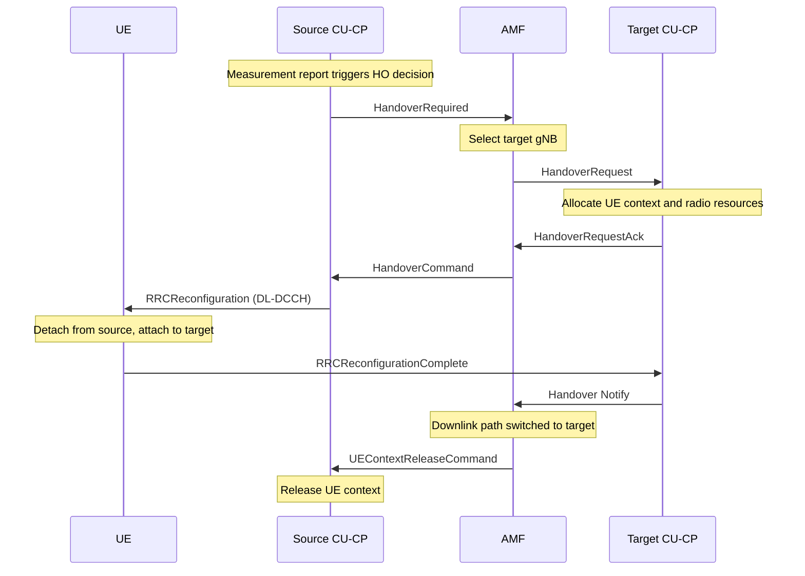

#### Handover Preparation (Source)

Initiates inter-gNB handover from the source side (TS 38.413 §8.4.1). Collects the RRC container from the RRC UE, sends Handover Required to the AMF, and on receipt of the Handover Command forwards the RRC reconfiguration to CU-CP.

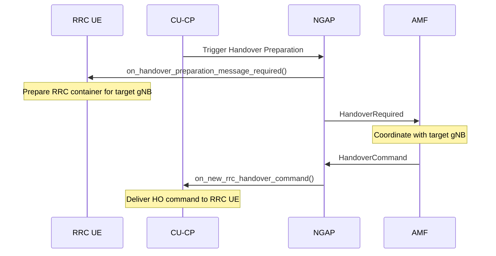

#### Handover Resource Allocation (Target)

Allocates resources on the target gNB when the AMF sends a Handover Request (TS 38.413 §8.4.2).

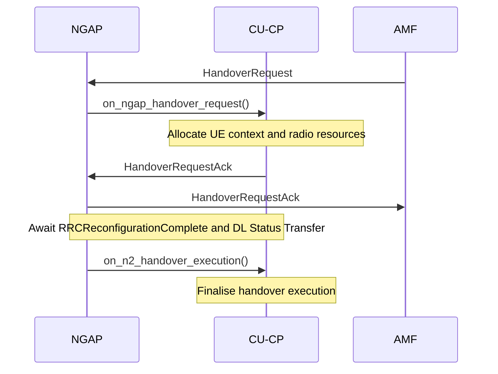

#### Path Switch

Notifies the AMF to switch the downlink path to the new gNB after an intra-5GS handover (TS 38.413 §8.4.4).

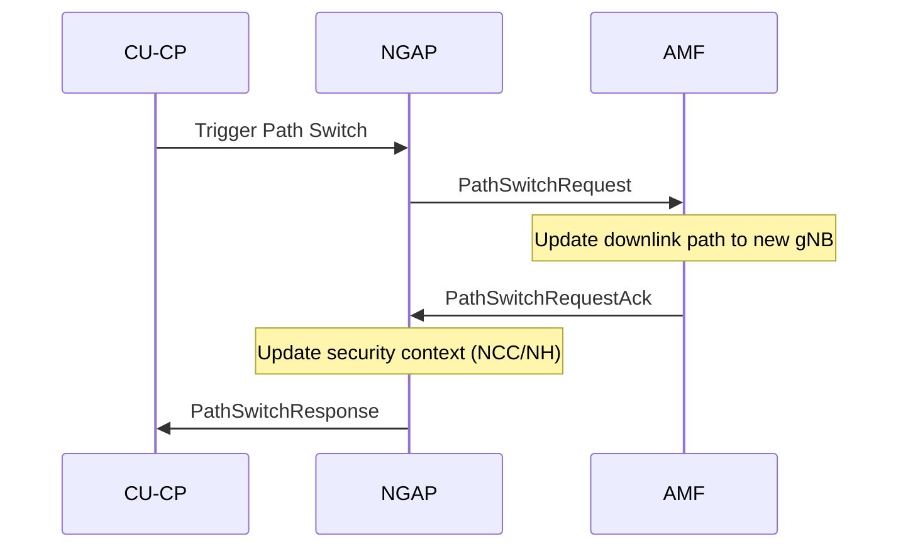

#### DL RAN Status Transfer

Receives PDCP sequence number state forwarded by the AMF from the source gNB to the target during handover (TS 38.413 §8.4.5).

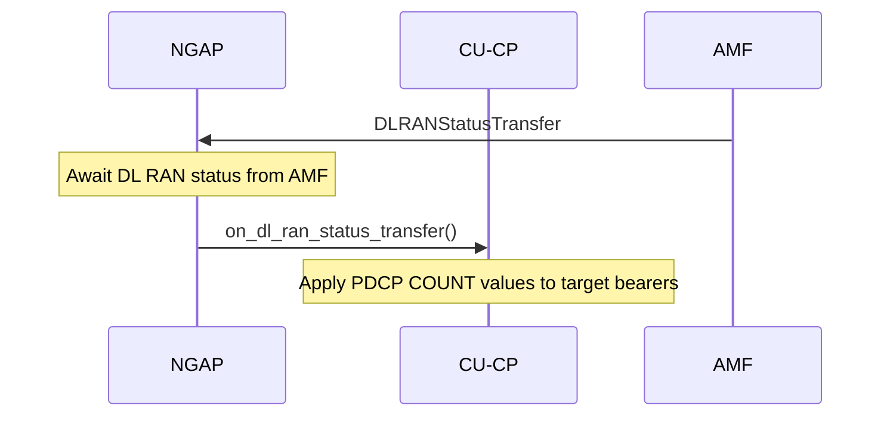
