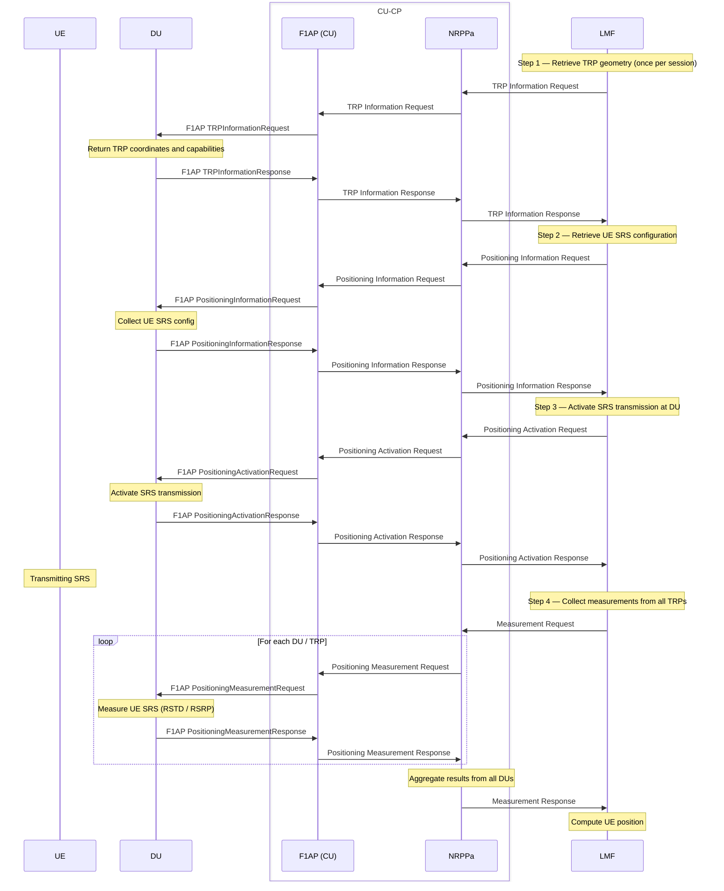
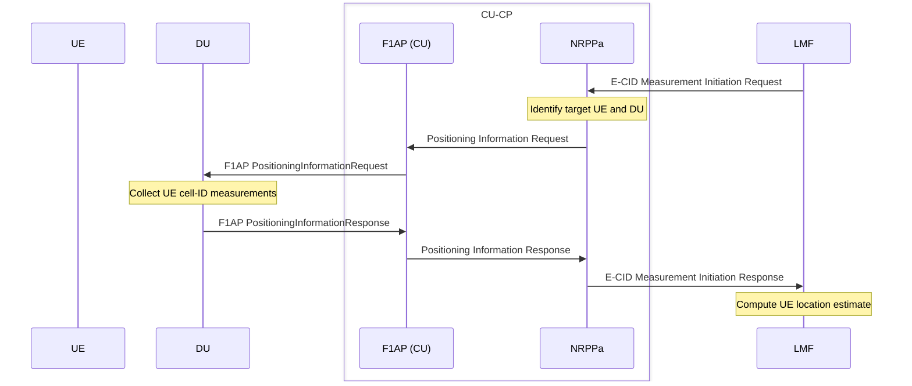
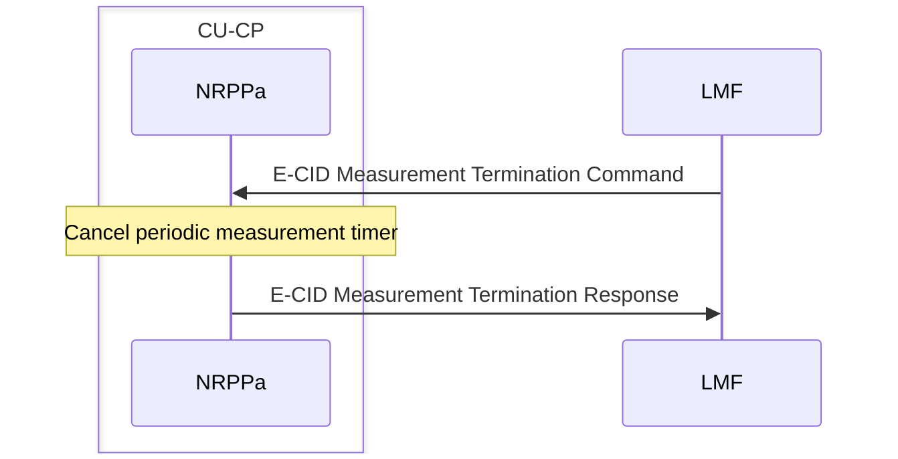
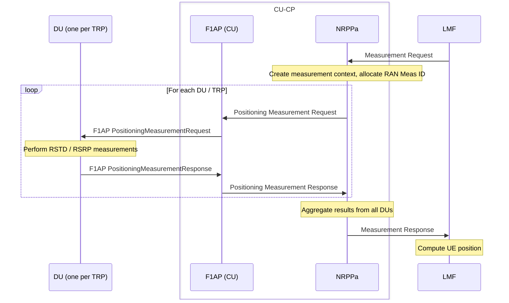
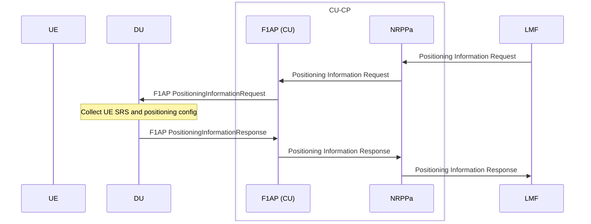
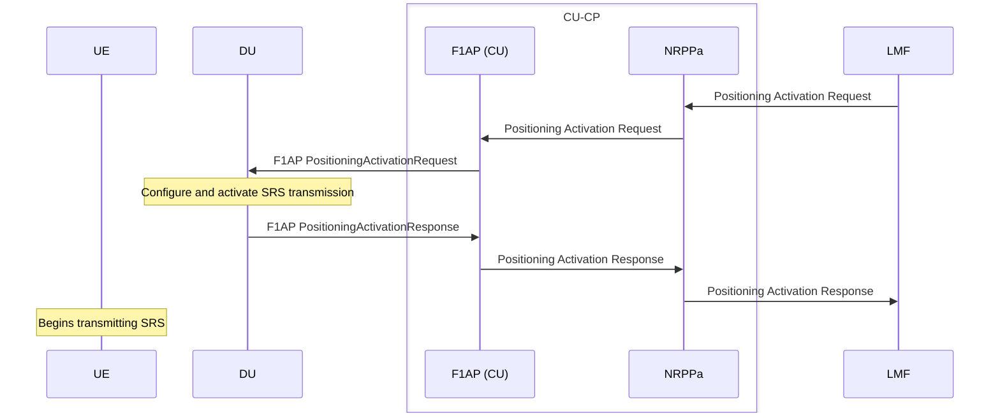
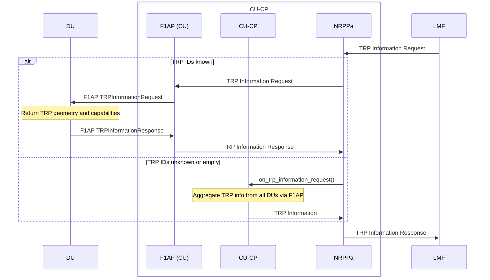

# NRPPa

The NRPPa layer implements the NR Positioning Protocol A interface between the CU-CP and the Location Management Function (LMF) (TS 38.455). NRPPa messages are transported by NGAP (via UE-associated and non-UE-associated transport), but are handled independently of NGAP by this layer.

Responsibilities:

- Dispatch incoming NRPPa PDUs from the LMF to the appropriate procedure.
- Coordinate with the F1AP layer to request DU-side positioning measurements and configuration.
- Aggregate measurement results from multiple DUs and return them to the LMF.
- Maintain per-UE and per-DU measurement contexts for periodic measurements.

The NRPPa layer interfaces with:
- `nrppa_cu_cp_notifier` — to request TRP information or aggregate results from all DUs via CU-CP.
- `du_ctxt_list[du_index].f1ap` — to send F1AP positioning requests to individual DUs.

The public contract is expressed through `include/ocudu/nrppa/nrppa.h`.

---

## Procedures

| Procedure | File | 3GPP reference |
|-----------|------|----------------|
| E-CID Measurement Initiation | `e_cid_measurement_initiation_procedure.cpp` | TS 38.455 §8.8.1 |
| E-CID Measurement Termination | `e_cid_measurement_termination_procedure.cpp` | TS 38.455 §8.8.2 |
| Measurement | `measurement_procedure.cpp` | TS 38.455 §8.1.1 |
| Positioning Information Exchange | `positioning_information_exchange_procedure.cpp` | TS 38.455 §8.10.1 |
| Positioning Activation | `positioning_activation_procedure.cpp` | TS 38.455 §8.9.1 |
| TRP Information Exchange | `trp_information_exchange_procedure.cpp` | TS 38.455 §8.7.1 |

### End-to-End Positioning Flow

A complete positioning session requires four NRPPa exchanges in sequence. TRP information and positioning information are typically fetched once per session; activation and measurements repeat as needed.

### E-CID Measurement Initiation

Requests Enhanced Cell ID (E-CID) measurements for a specific UE (TS 38.455 §8.8.1). Supports on-demand (single-shot) and periodic measurement modes. For on-demand measurements the result is returned immediately; for periodic measurements a timer is configured and results are reported at each interval.

### E-CID Measurement Termination

Stops an ongoing periodic E-CID measurement session for a UE (TS 38.455 §8.8.2).

### Measurement

Coordinates positioning measurements across multiple DUs for a given measurement request (TS 38.455 §8.1.1). The NRPPa layer fans out F1AP Positioning Measurement Requests to each relevant DU, aggregates the results, and returns them to the LMF.

### Positioning Information Exchange

Retrieves SRS configuration and other positioning-related information for a UE from its serving DU (TS 38.455 §8.10.1).

### Positioning Activation

Activates semi-persistent or aperiodic SRS transmission at the DU for a UE, enabling uplink reference signal measurements (TS 38.455 §8.9.1).

### TRP Information Exchange

Retrieves Transmission/Reception Point (TRP) information from connected DUs (TS 38.455 §8.7.1). If the requested TRP IDs are unknown or the list is empty, the NRPPa layer requests the information from the CU-CP, which aggregates it across all DUs.

