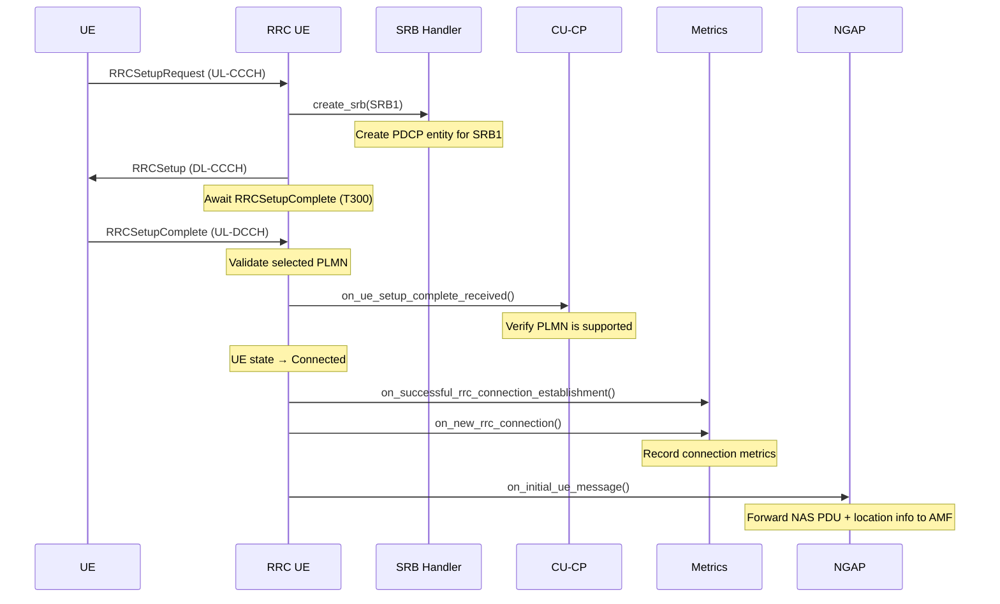
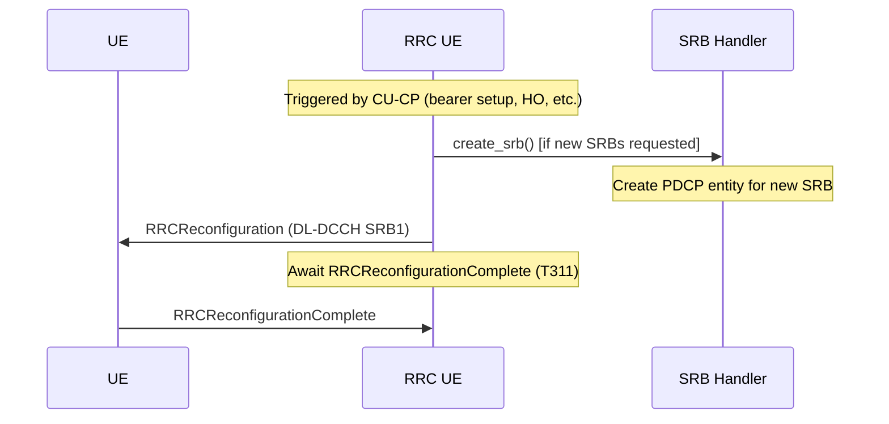
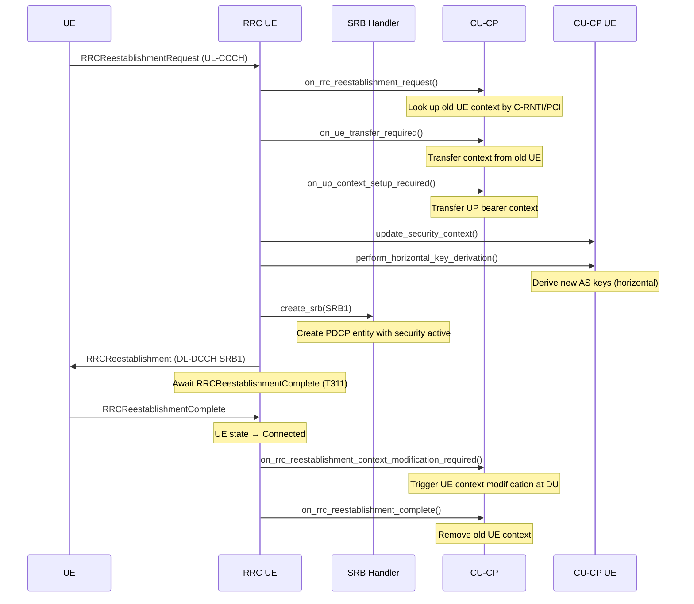
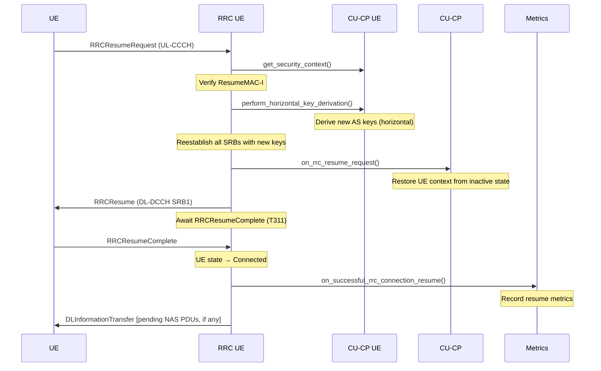
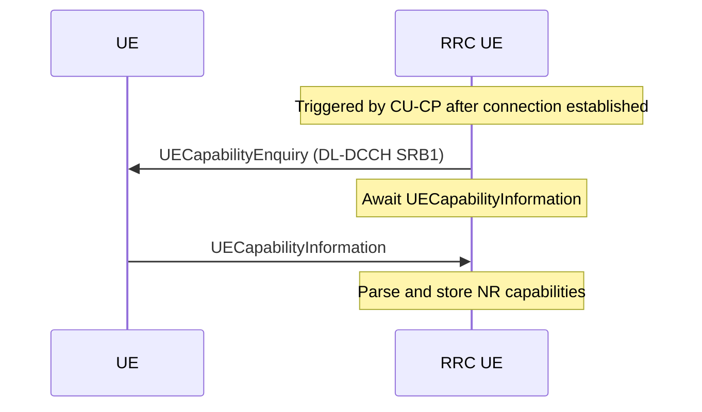

# RRC UE Layer

The RRC UE layer implements the per-UE Radio Resource Control state machine as defined in **3GPP TS 38.331**. Each connected UE is represented by an `rrc_ue_impl` instance that owns the UE's RRC context, SRB lifecycle, and the coroutine-based procedures that drive state transitions.

Responsibilities:

- Encode and decode RRC messages (DL/UL-CCCH and DL/UL-DCCH) via the ASN.1 codec helpers.
- Manage the UE's RRC state (`idle → connected → inactive`) and the associated SRB bearers.
- Run procedures as async coroutine tasks, suspending on UE responses and resuming on receipt of the matching UL-DCCH message.
- Forward NAS PDUs and location information to the NGAP layer via `rrc_ue_ngap_notifier`.
- Notify the CU-CP orchestration layer of context updates via `rrc_ue_context_update_notifier`.

The public contract of the layer is expressed through the interfaces in `include/ocudu/rrc/rrc_ue.h`. Inbound messages arrive through `rrc_ul_pdu_handler` and `rrc_ngap_message_handler`; outbound messages leave through the corresponding notifier interfaces.

---

## Procedures

Procedures live in [`procedures/`](procedures/) and follow a common coroutine pattern: send a downlink message, suspend on a transaction, validate the response, and notify upstream components on success or trigger a UE release on failure. Transaction timeouts are governed by the 3GPP timer specified for each procedure (e.g. T300 for RRC Setup).

| Procedure | File | 3GPP reference |
|-----------|------|----------------|
| RRC Setup | `rrc_setup_procedure.cpp` | TS 38.331 §5.3.3 |
| RRC Reconfiguration | `rrc_reconfiguration_procedure.cpp` | TS 38.331 §5.3.5 |
| RRC Reestablishment | `rrc_reestablishment_procedure.cpp` | TS 38.331 §5.3.7 |
| RRC Resume | `rrc_resume_procedure.cpp` | TS 38.331 §5.3.13 |
| UE Capability Transfer | `rrc_ue_capability_transfer_procedure.cpp` | TS 38.331 §5.6.1 |

### RRC Setup

Establishes the initial RRC connection. The procedure creates SRB1, sends an `RRCSetup` message to the UE, and waits for `RRCSetupComplete`. On success it validates the selected PLMN, transitions the UE to `connected`, and forwards the NAS PDU to the AMF via an NGAP Initial UE Message. For the full cross-layer flow see the [CU-CP message flows](../../cu_cp/README.md#rrc-setup).

### RRC Reconfiguration

Modifies the UE's radio configuration while connected — used to add or release SRBs/DRBs, update measurement config, or deliver a handover command (TS 38.331 §5.3.5). The procedure creates any new SRBs first, then sends the `RRCReconfiguration` and awaits the complete. Timer T311 governs the wait.

### RRC Reestablishment

Re-establishes the RRC connection after a radio link failure (TS 38.331 §5.3.7). The procedure verifies the ShortMAC-I against the old UE's security context, transfers the UP and security contexts to the new UE instance, creates SRB1 with active PDCP security, and triggers a UE context modification at the DU after success.

### RRC Resume

Resumes a UE from RRC Inactive state (TS 38.331 §5.3.13). The procedure verifies the ResumeMAC-I, derives new AS keys, reestablishes all SRBs, and sends any pending downlink NAS PDUs once the UE is connected again.

### UE Capability Transfer

Queries and stores the UE's radio access capabilities (TS 38.331 §5.6.1). Skipped if capabilities are already present in the UE context.

