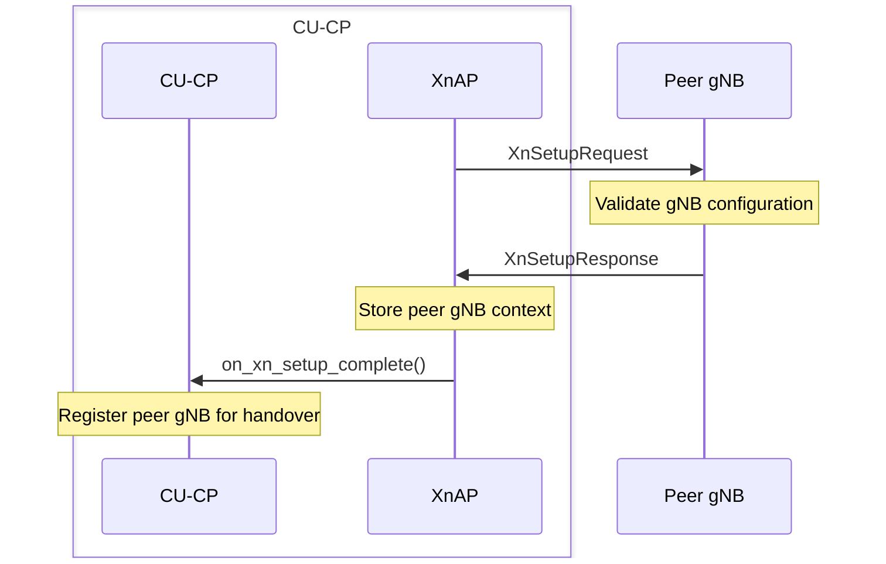
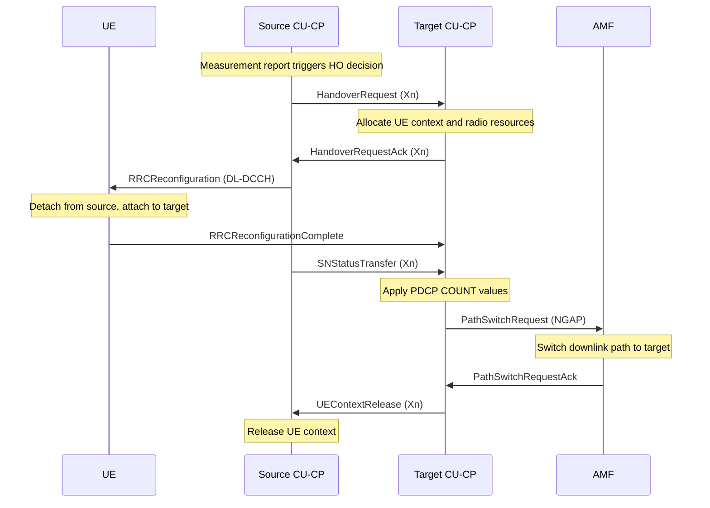
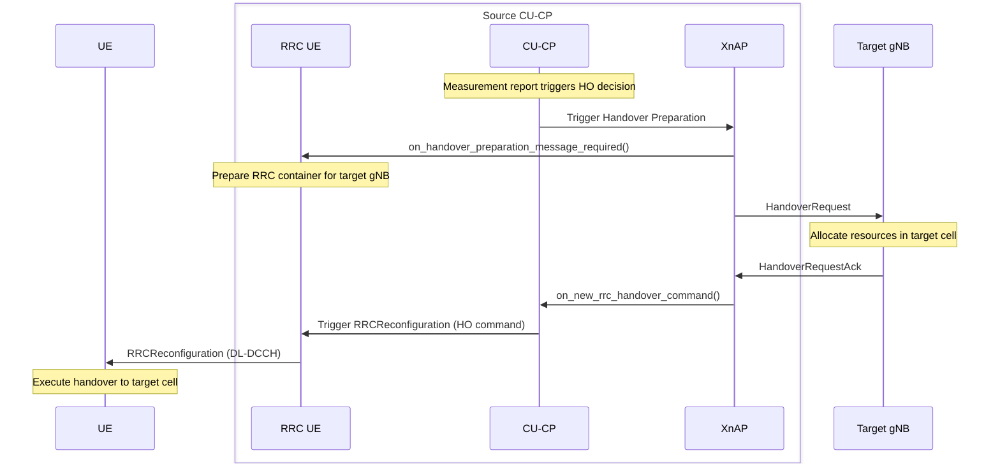
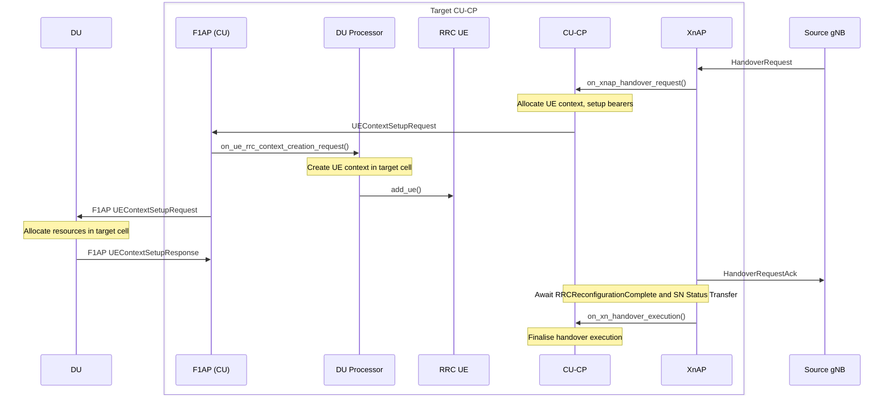
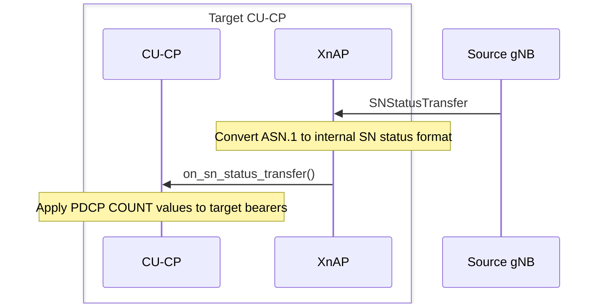

# XnAP

The XnAP layer implements the Xn-c control plane interface between two gNBs (TS 38.423). It enables direct inter-gNB handover without involving the AMF and transfers PDCP sequence number state between nodes during handover execution.

Responsibilities:

- Manage the Xn association lifecycle (Xn Setup).
- Run handover preparation procedures on the source and target sides.
- Transfer PDCP SN state from source to target after the UE executes the handover.
- Translate between XnAP ASN.1 message types and the CU-CP's internal types via `xnap_cu_cp_notifier`.

The public contract is expressed through `include/ocudu/xnap/xnap.h`.

---

## Procedures

### Association Management

Procedure that establishes the Xn-c connection between two gNBs.

| Procedure | File | 3GPP reference |
|-----------|------|----------------|
| Xn Setup | `xn_setup_procedure.cpp` | TS 38.423 §8.10.1 |

#### Xn Setup

Establishes the Xn-c connection between two gNBs (TS 38.423 §8.10.1). Retries with the peer-provided back-off timer on failure.

### Handover

Procedures that coordinate inter-gNB handover directly between two gNBs, including PDCP state transfer after execution. See also [NGAP](../../ngap/README.md) for AMF-coordinated handover.

| Procedure | File | 3GPP reference |
|-----------|------|----------------|
| Handover Preparation (Source) | `xnap_source_handover_preparation_procedure.cpp` | TS 38.423 §8.6.2 |
| Handover Preparation (Target) | `xnap_target_handover_preparation_procedure.cpp` | TS 38.423 §8.6.1 |
| SN Status Transfer | `xnap_sn_status_transfer_procedure.cpp` | TS 38.423 §8.8.1 |

#### Handover — End-to-End

Complete Xn-based inter-gNB handover flow (TS 38.423 §8.6). The source initiates with a Handover Request directly to the target. After the UE connects to the target, the source forwards PDCP state, and the target notifies the AMF via NGAP Path Switch to reroute the downlink.

#### Handover Preparation (Source)

Initiates an inter-gNB handover from the source side over Xn (TS 38.423 §8.6.2). Sends the Handover Request directly to the target gNB and awaits the Handover Request Ack. Sends a Handover Cancel on timeout.

#### Handover Preparation (Target)

Allocates resources on the target side when a peer gNB sends a Handover Request over Xn (TS 38.423 §8.6.1). Notifies the CU-CP to allocate the UE context and bearers, then sends the Handover Request Ack back to the source. Notifies the CU-CP to await the RRC Reconfiguration Complete and SN Status Transfer.

#### SN Status Transfer

Transfers PDCP sequence number state (COUNT values) from the source gNB to the target gNB after the UE executes the handover, ensuring lossless bearer continuity (TS 38.423 §8.8.1).

